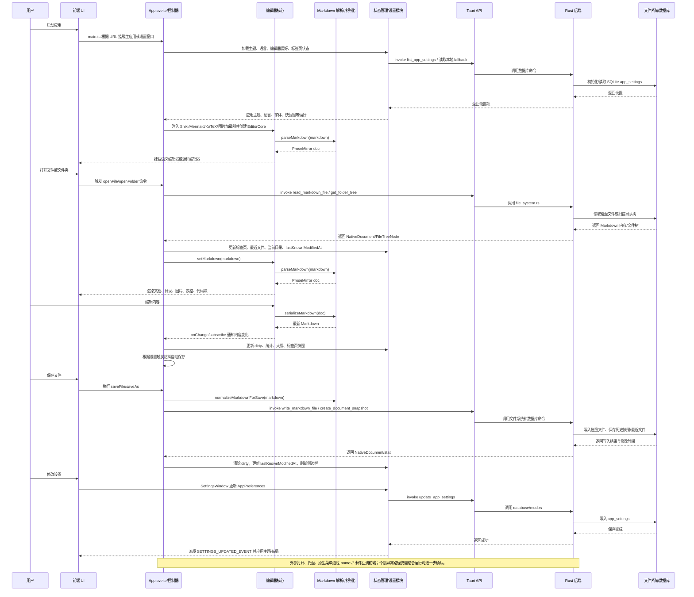

# 项目文件说明

本文档基于当前仓库源码整理，目标是帮助快速理解 Nomo Markdown 编辑器的文件职责、模块边界和核心运行流程。

检查范围：

* 已检查 `src/`、`src-tauri/src/`、`src/quicklook/`、`src-tauri/macos/NomoQuickLookPreview/`、配置文件、脚本和本地化文件。
* 已排除 `node_modules`、`dist`、`build`、`.git`、`src-tauri/target`、`src-tauri/gen`、锁文件、图片、字体和二进制文件。
* `src/paraglide/` 是本地化工具生成代码，文档中按生成物整体说明，不建议手工修改。

## 1. 项目整体结构概览

项目整体可以理解为一个 Svelte + ProseMirror + Tauri 的桌面 Markdown 编辑器，主要分为以下模块。

* 前端 UI 层：位于 `src/app/`，负责应用壳、标题栏、侧边栏、标签页、编辑区、设置窗口、状态栏和交互控制。
* 编辑器核心层：位于 `src/lib/editor-core/`，用 ProseMirror 承载语义编辑能力，对外暴露稳定的 `EditorCore` API。
* Markdown 解析与序列化层：主要位于 `src/lib/editor-core/markdown.ts`、`schema.ts`、`src/lib/markdown/`，负责 Markdown 与 ProseMirror 文档模型互转。
* 渲染增强层：位于 `src/lib/services/` 与 `src/lib/editor-core/nodeViews/`，负责 Shiki 代码高亮、KaTeX 公式、Mermaid 图表、图片预览和各类 NodeView。
* 文件系统层：前端位于 `src/app/services/documentFiles.ts`、`folderExplorerController.ts`，后端位于 `src-tauri/src/file_system.rs` 与 `src-tauri/src/file_system/image_assets.rs`。
* 设置与数据持久化层：前端位于 `src/app/services/settings.ts`、`src/lib/desktop/tauriStorage.ts`，后端位于 `src-tauri/src/database/`，核心存储是 SQLite 的 `app_settings` 表。
* Tauri / Rust 后端层：位于 `src-tauri/src/`，负责 IPC 命令、SQLite、窗口、菜单、托盘、文件关联、外部打开和软件更新。
* Quick Look 预览层：位于 `src/quicklook/` 与 `src-tauri/macos/NomoQuickLookPreview/`，负责 macOS Quick Look 扩展渲染。
* 构建与配置层：包括 `package.json`、`vite.config.ts`、`vite.quicklook.config.ts`、`src-tauri/tauri*.conf.json`、`Cargo.toml` 和脚本。

## 2. 项目整体运行时序图

## 3. 文件说明

### 根目录与构建配置

#### `package.json`

* 所属模块：前端包管理与脚本。
* 主要职责：定义 Svelte/Vite/Tauri 开发、构建、检查、测试脚本。
* 功能简介：核心依赖包含 Svelte 5、ProseMirror、markdown-it、KaTeX、Mermaid、Shiki、Tauri API。
* 依赖/被依赖关系：被 `pnpm`、Vite、Tauri CLI 和测试流程使用。
* 备注：存在 `package-lock.json`，但项目声明使用 `pnpm@11.5.1`，锁文件策略建议统一。

#### `index.html`

* 所属模块：前端 HTML 入口。
* 主要职责：提供 Vite 主应用挂载节点并加载 `src/main.ts`。
* 功能简介：Tauri 主窗口与开发模式 Web 页面共用入口。
* 依赖/被依赖关系：被 Vite/Tauri 加载。
* 备注：职责清晰。

#### `vite.config.ts`

* 所属模块：前端构建配置。
* 主要职责：配置 Svelte 插件、测试环境和 Vite 构建。
* 功能简介：服务主应用开发、构建和 Vitest。
* 依赖/被依赖关系：被 `pnpm dev`、`pnpm build`、`vitest` 使用。
* 备注：职责清晰。

#### `vite.quicklook.config.ts`

* 所属模块：Quick Look 渲染器构建配置。
* 主要职责：为 Quick Look 预览入口单独构建静态资源。
* 功能简介：配合 macOS Quick Look 扩展嵌入前端预览页面。
* 依赖/被依赖关系：被 `build:quicklook-renderer` 使用。
* 备注：与主应用构建分离合理。

#### `svelte.config.js`

* 所属模块：Svelte 编译配置。
* 主要职责：启用 Vite 预处理。
* 功能简介：提供 `.svelte` 文件编译支持。
* 依赖/被依赖关系：被 Vite Svelte 插件读取。
* 备注：职责清晰。

#### `tsconfig.json` / `tsconfig.node.json` / `src/vite-env.d.ts`

* 所属模块：TypeScript 配置。
* 主要职责：定义浏览器、Svelte、Node/Vite 配置文件的类型检查范围。
* 功能简介：`vite-env.d.ts` 补充 Vite 客户端类型。
* 依赖/被依赖关系：被 `svelte-check`、Vite、Vitest、编辑器语言服务使用。
* 备注：职责清晰。

#### `project.inlang/`

* 所属模块：本地化资源配置。
* 主要职责：保存 `zh-CN`、`zh-TW`、`en-US`、`ja-JP` 文案源文件和 Inlang 设置。
* 功能简介：为 `src/paraglide/` 生成运行时代码。
* 依赖/被依赖关系：被 Paraglide/Inlang 工具链读取。
* 备注：文案源应改这里，不应直接改生成物。

#### `scripts/build-macos-quicklook.sh`

* 所属模块：macOS 构建脚本。
* 主要职责：构建 Quick Look 扩展。
* 功能简介：配合主应用 macOS 打包流程生成预览扩展产物。
* 依赖/被依赖关系：被 `package.json` 的 `build:quicklook-extension` 调用。
* 备注：仅 macOS 构建路径使用。

#### `scripts/embed-quicklook-extension.sh`

* 所属模块：macOS 打包脚本。
* 主要职责：把 Quick Look 扩展嵌入打包后的应用。
* 功能简介：在 Tauri macOS 打包后补齐 `.appex`。
* 依赖/被依赖关系：被 `build:macos` 调用。
* 备注：仅 macOS 发布路径使用。

#### `html/index.html` / `html/style.css`

* 所属模块：静态原型或说明页面。
* 主要职责：提供一套独立 HTML/CSS 页面。
* 功能简介：未看到其接入主应用运行链路，可能是设计稿、原型或历史静态页面。
* 依赖/被依赖关系：作用不明确，未在主构建链路中发现直接依赖。
* 备注：建议确认是否仍需保留，避免与真实应用样式混淆。

### `src/main.ts`

#### `src/main.ts`

* 所属模块：前端入口。
* 主要职责：加载全局样式和 KaTeX 样式，按 URL 参数决定挂载主应用或设置窗口。
* 功能简介：`view=settings` 时挂载 `SettingsWindow`，否则挂载 `App`。
* 依赖/被依赖关系：依赖 `App.svelte`、`SettingsWindow.svelte`、全局样式；被 `index.html` 加载。
* 备注：职责清晰。

### `src/app/`

#### `src/app/App.svelte`

* 所属模块：前端应用装配层。
* 主要职责：连接 Tauri、编辑器核心、文件系统、设置、标签页、目录树、菜单、快捷键、外部文件变化和窗口生命周期。
* 功能简介：初始化渲染服务，创建 `EditorCore`，加载设置和工作区状态，协调打开、保存、自动保存、模式切换、外部打开、关闭确认等流程。
* 依赖/被依赖关系：依赖 `src/app/services/*`、`src/lib/editor-core/*`、`src/lib/desktop/*`、`src/lib/services/*`；被 `main.ts` 挂载。
* 备注：文件体积很大，虽然已拆出多个 controller，但仍承担过多装配和状态职责。

#### `src/app/types.ts`

* 所属模块：前端领域类型。
* 主要职责：定义 `Tab`、`FileTreeNode`、`WorkspaceState`、外部文件变更状态等类型。
* 功能简介：作为应用状态、标签页、目录树和持久化状态的类型契约。
* 依赖/被依赖关系：被 `App.svelte`、控制器和组件广泛依赖。
* 备注：职责清晰。

#### `src/app/i18n.ts`

* 所属模块：前端本地化。
* 主要职责：提供界面文案、语言切换、格式化函数和语言选项。
* 功能简介：当前包含大量中文、繁体、英文文案，并接入部分 Paraglide 生成消息。
* 依赖/被依赖关系：被 UI 组件、服务控制器和设置窗口依赖。
* 备注：体积偏大，建议逐步迁移到 `project.inlang/messages` 或按业务域拆分。

#### `src/app/i18n.ja.ts`

* 所属模块：日文本地化补充。
* 主要职责：保存日语文案映射。
* 功能简介：为 `i18n.ts` 提供 `ja-JP` 文案来源。
* 依赖/被依赖关系：被 `i18n.ts` 依赖。
* 备注：职责清晰。

### `src/app/components/`

#### `AppShell.svelte`

* 所属模块：应用布局 UI。
* 主要职责：组装标题栏、侧边栏、标签栏、编辑区、状态栏、对话框等顶层组件。
* 功能简介：主要通过 props 和回调把 `App.svelte` 的状态下发给子组件。
* 依赖/被依赖关系：依赖多个 UI 组件；被 `App.svelte` 使用。
* 备注：职责相对清晰，是较好的装配边界。

#### `AppTitleBar.svelte`

* 所属模块：桌面标题栏与菜单 UI。
* 主要职责：显示应用标题、原生窗口控制、顶层菜单、拖拽区和平台差异样式。
* 功能简介：通过 Tauri window API 处理拖拽、最小化、最大化、关闭等动作。
* 依赖/被依赖关系：依赖 `@tauri-apps/api/window`、平台能力、菜单命令回调；被 `AppShell` 使用。
* 备注：文件偏大，菜单渲染和窗口控制可继续拆分。

#### `ExplorerSidebar.svelte`

* 所属模块：资源管理器侧边栏。
* 主要职责：展示目录树、最近文件、行内重命名、创建文件/文件夹、右键菜单和侧栏 resize。
* 功能简介：通过 `folderTree`、`explorerRows` 和父级回调驱动文件夹展开、文件打开和文件操作。
* 依赖/被依赖关系：依赖 `ContextMenu` 和文件树状态；被 `AppShell` 使用。
* 备注：文件偏大，目录树行组件和右键菜单逻辑可以拆分。

#### `DocumentTabs.svelte`

* 所属模块：标签页 UI。
* 主要职责：展示打开文档、切换标签、关闭标签、固定预览标签和右键菜单。
* 功能简介：根据 `Tab` 状态渲染 dirty、active、preview 等状态。
* 依赖/被依赖关系：依赖 `ContextMenu`；被 `AppShell` 使用。
* 备注：职责清晰，体积略高但内聚。

#### `EditorToolbar.svelte`

* 所属模块：编辑工具栏。
* 主要职责：提供标题、行内格式、列表、表格、公式、图表等编辑命令入口。
* 功能简介：把按钮操作转换成 `EditorCommand` 传给编辑器核心。
* 依赖/被依赖关系：依赖 `EditorCommand` 和图表模板；被 `AppShell` 使用。
* 备注：职责清晰，后续可按命令组拆小组件。

#### `EditorWorkspace.svelte`

* 所属模块：编辑工作区。
* 主要职责：承载源码 textarea、ProseMirror 挂载点、Front Matter 卡片、大纲和外部变更提示。
* 功能简介：根据模式和状态切换语义编辑、源码编辑、只读和大文档提示。
* 依赖/被依赖关系：依赖 `FrontMatterCard`；被 `AppShell` 使用。
* 备注：职责清晰。

#### `SettingsWindow.svelte`

* 所属模块：设置中心 UI。
* 主要职责：提供通用、编辑器、外观、文件、图片、统计、高级、关于等设置页。
* 功能简介：加载/保存 `AppPreferences`，处理软件更新、文件关联、右键菜单、图片上传配置等设置项。
* 依赖/被依赖关系：依赖 `settings.ts`、`tauriUpdater.ts`、平台能力、Tauri IPC 和本地化文案；由 `main.ts` 在设置窗口模式挂载。
* 备注：体积过大，是当前最明显的 UI 拆分候选。

#### `StatusBar.svelte`

* 所属模块：底部状态栏。
* 主要职责：展示当前文档状态、字数统计、模式、路径和状态消息。
* 功能简介：为用户提供编辑状态反馈和统计入口。
* 依赖/被依赖关系：被 `AppShell` 使用。
* 备注：职责清晰。

#### `FrontMatterCard.svelte`

* 所属模块：Front Matter UI。
* 主要职责：展示和编辑 Markdown front matter 摘要。
* 功能简介：和 `src/lib/markdown/frontMatter.ts` 配合处理 YAML 块。
* 依赖/被依赖关系：被 `EditorWorkspace` 使用。
* 备注：职责清晰。

#### `ContextMenu.svelte`

* 所属模块：通用右键菜单。
* 主要职责：菜单定位、点击外部关闭、Escape 关闭、菜单项执行。
* 功能简介：服务标签页、侧边栏等上下文菜单。
* 依赖/被依赖关系：被多个组件复用。
* 备注：职责清晰。

#### `ConfirmDialog.svelte`

* 所属模块：通用确认对话框。
* 主要职责：提供确认/取消式弹窗。
* 功能简介：用于删除、关闭、覆盖等危险操作确认。
* 依赖/被依赖关系：被 `AppShell` 使用。
* 备注：职责清晰。

#### `CloseWindowBehaviorDialog.svelte`

* 所属模块：关闭行为设置弹窗。
* 主要职责：在关闭窗口时询问退出、隐藏到托盘等行为。
* 功能简介：和设置项 `closeWindowBehavior` 配合。
* 依赖/被依赖关系：被 `AppShell` 使用。
* 备注：职责清晰。

#### `FolderOpenDialog.svelte`

* 所属模块：打开文件夹确认弹窗。
* 主要职责：询问用户打开文件夹时采用当前窗口或新窗口等行为。
* 功能简介：与文件夹打开默认行为设置配合。
* 依赖/被依赖关系：被 `AppShell` 使用。
* 备注：职责清晰。

#### `LinkQuickEditor.svelte`

* 所属模块：链接快捷编辑 UI。
* 主要职责：提供链接文本和 URL 的快速编辑入口。
* 功能简介：配合编辑器链接交互插件。
* 依赖/被依赖关系：被 `AppShell`/编辑器交互链路使用。
* 备注：职责清晰。

#### `EmptyWorkspace.svelte`

* 所属模块：空状态 UI。
* 主要职责：在未打开文档或目录时显示引导操作。
* 功能简介：提供新建、打开文件、打开文件夹等入口。
* 依赖/被依赖关系：被 `AppShell` 使用。
* 备注：职责清晰。

### `src/app/actions/`

#### `clickOutside.ts`

* 所属模块：Svelte action。
* 主要职责：检测元素外部点击。
* 功能简介：用于弹层、菜单、下拉等关闭逻辑。
* 依赖/被依赖关系：被 UI 组件复用。
* 备注：职责清晰。

#### `motion.ts`

* 所属模块：动效工具。
* 主要职责：封装 GSAP/DOM 动画和降级策略。
* 功能简介：为弹窗、菜单、面板等 UI 提供统一动效。
* 依赖/被依赖关系：被组件层使用，并有 `motion.test.ts` 覆盖。
* 备注：职责清晰。

### `src/app/services/`

#### `appCommands.ts`

* 所属模块：应用命令与快捷键。
* 主要职责：把菜单命令、全局快捷键和编辑器命令连接起来。
* 功能简介：处理 `new-file`、`save-file`、`menu-link`、`insert-diagram:*` 等命令分发。
* 依赖/被依赖关系：依赖 `EditorCommand`、快捷键设置和应用回调；被 `App.svelte` 使用。
* 备注：职责清晰但命令列表继续增多时可拆分命令注册表。

#### `appUiState.ts`

* 所属模块：UI 状态工具。
* 主要职责：处理菜单开关、侧栏宽度计算等轻量状态逻辑。
* 功能简介：把纯 UI 计算从 `App.svelte` 中抽离。
* 依赖/被依赖关系：被 `App.svelte` 使用。
* 备注：职责清晰。

#### `desktopImageLoader.ts`

* 所属模块：桌面图片加载。
* 主要职责：把 Markdown 图片路径解析为可预览资源。
* 功能简介：对接 Tauri asset 协议、本地路径和文档目录，服务图片 NodeView。
* 依赖/被依赖关系：依赖 `tauriStorage` 图片解析 IPC；被编辑器渲染适配器使用。
* 备注：职责清晰。

#### `desktopWindow.ts`

* 所属模块：桌面窗口前端适配。
* 主要职责：封装 Tauri 窗口状态、关闭请求、菜单事件、外部打开事件等能力。
* 功能简介：为 `App.svelte` 提供窗口生命周期和事件监听 API。
* 依赖/被依赖关系：依赖 Tauri API；被应用入口和设置流程使用。
* 备注：职责清晰。

#### `documentActionsController.ts`

* 所属模块：文档操作控制器。
* 主要职责：处理打开、拖拽打开、保存、另存、自动保存、外部文件变化和标签页文档状态切换。
* 功能简介：在前端应用状态、编辑器、文件系统 IPC 和恢复草稿之间协调。
* 依赖/被依赖关系：依赖 `documentFiles.ts`、`tabs.ts`、`normalizeMarkdownForSave`、`outlineService`；被 `App.svelte` 创建。
* 备注：文件偏大但业务内聚，后续可按打开/保存/外部变更拆分。

#### `documentFiles.ts`

* 所属模块：文档文件前端 IO。
* 主要职责：封装打开文件、读取路径、保存文件、最近文件、目录树、文件夹索引等前端调用。
* 功能简介：把浏览器 File API 与 Tauri IPC 差异收口。
* 依赖/被依赖关系：依赖 `tauriStorage.ts`、Tauri dialog；被文档控制器和目录控制器使用。
* 备注：职责清晰。

#### `editorInteractionController.ts`

* 所属模块：编辑器交互控制器。
* 主要职责：处理编辑/源码模式切换、滚动锚点恢复、源码 textarea 高度同步、命令执行和 TOC 插入。
* 功能简介：模式切换时按大纲锚点恢复视觉焦点，避免强制回到不可见光标。
* 依赖/被依赖关系：依赖 `EditorCore`、`outlineNavigation.ts`、`tocService.ts`；被 `App.svelte` 使用。
* 备注：职责清晰，是模式切换逻辑的主要位置。

#### `editorSettingsController.ts`

* 所属模块：编辑器设置应用控制器。
* 主要职责：把设置偏好应用到编辑器和界面。
* 功能简介：处理字体、主题、布局、模式等设置同步。
* 依赖/被依赖关系：依赖 `settings.ts` 和应用回调；被 `App.svelte` 使用。
* 备注：职责清晰。

#### `explorerRows.ts`

* 所属模块：资源管理器展示模型。
* 主要职责：把树形目录拍平成可渲染行。
* 功能简介：为侧边栏提供层级缩进、展开状态和行数据。
* 依赖/被依赖关系：依赖 `FileTreeNode`；被 `ExplorerSidebar` 使用。
* 备注：职责清晰。

#### `firstRunSample.ts`

* 所属模块：首次运行示例文档。
* 主要职责：判断和安装示例 Markdown。
* 功能简介：通过后端安装示例文件并打开。
* 依赖/被依赖关系：依赖 `documentFiles.ts` 或 Tauri 文件系统能力；被 `App.svelte` 使用。
* 备注：职责清晰。

#### `folderExplorerController.ts`

* 所属模块：文件夹资源管理控制器。
* 主要职责：加载文件夹、展开祖先目录、懒加载子目录、同步已加载目录、处理后台索引批次。
* 功能简介：连接前端目录树状态与 Rust 后端目录扫描能力。
* 依赖/被依赖关系：依赖 `documentFiles.ts`、`folderTree.ts`、`tauriStorage.ts`；被 `App.svelte` 使用。
* 备注：职责清晰，已经处理空目录和无限层级树。

#### `folderTree.ts`

* 所属模块：文件夹树纯函数。
* 主要职责：目录树归一化、路径查找、展开折叠、插入/删除/更新子节点。
* 功能简介：为资源管理器提供不可变树更新工具。
* 依赖/被依赖关系：被 `folderExplorerController.ts` 和 UI 侧边栏使用。
* 备注：职责清晰。

#### `imageInsertion.ts`

* 所属模块：图片插入流程。
* 主要职责：根据设置把图片插入为链接、复制到资源目录或上传。
* 功能简介：处理图片导入策略、Markdown 片段生成和编辑器插入。
* 依赖/被依赖关系：依赖 `imageMarkdown.ts`、渲染服务类型和 Tauri 图片 IPC；被编辑器命令链路使用。
* 备注：职责清晰。

#### `imageMarkdown.ts`

* 所属模块：图片 Markdown 工具。
* 主要职责：生成带 alt、title、align、width、height 的图片 Markdown。
* 功能简介：为图片插入和序列化保持一致格式。
* 依赖/被依赖关系：被 `imageInsertion.ts` 使用。
* 备注：职责清晰。

#### `outlineInteractionController.ts`

* 所属模块：大纲交互控制器。
* 主要职责：处理点击大纲、滚动到标题、抑制滚动联动抖动。
* 功能简介：协调大纲项与语义/源码编辑区域滚动。
* 依赖/被依赖关系：依赖 `outlineNavigation.ts`；被 `App.svelte` 使用。
* 备注：职责清晰。

#### `outlineNavigation.ts`

* 所属模块：大纲与滚动定位。
* 主要职责：根据大纲项、DOM 块和源码行号计算滚动锚点并恢复滚动。
* 功能简介：支撑模式切换、点击大纲、源码/语义视图同步。
* 依赖/被依赖关系：被 `editorInteractionController.ts`、`outlineInteractionController.ts` 使用。
* 备注：文件偏大但逻辑内聚。

#### `outlineState.ts`

* 所属模块：大纲状态。
* 主要职责：计算当前激活大纲项、滚动抑制时间等状态。
* 功能简介：为状态栏/大纲面板提供当前标题定位。
* 依赖/被依赖关系：被 `App.svelte` 使用。
* 备注：职责清晰。

#### `platform.ts`

* 所属模块：平台能力检测。
* 主要职责：识别 macOS、Windows、桌面环境和可用能力。
* 功能简介：驱动 UI 文案、窗口按钮、文件关联、更新等平台差异。
* 依赖/被依赖关系：被组件和设置窗口使用。
* 备注：职责清晰。

#### `recoveryDraft.ts`

* 所属模块：恢复草稿。
* 主要职责：保存异常或阻塞操作前的草稿副本。
* 功能简介：降低未保存内容丢失风险。
* 依赖/被依赖关系：被文档操作流程使用。
* 备注：职责清晰。

#### `settings.ts`

* 所属模块：应用设置模型与持久化。
* 主要职责：定义 `AppPreferences`、默认值、归一化、加载、保存、主题/排版/布局应用逻辑。
* 功能简介：通过 Tauri SQLite 设置表和浏览器 fallback 管理所有偏好。
* 依赖/被依赖关系：依赖 `tauriStorage.ts`；被 `App.svelte`、`SettingsWindow.svelte` 和多个控制器使用。
* 备注：体积偏大，建议按模型、存储、应用副作用拆分。

#### `tabs.ts`

* 所属模块：标签页状态工具。
* 主要职责：创建空标签、选择可复用标签、定位 native document 对应标签。
* 功能简介：支持预览标签和多标签文档打开。
* 依赖/被依赖关系：被 `documentActionsController.ts` 和 `App.svelte` 使用。
* 备注：职责清晰。

### `src/app/styles/`

#### `app.css`

* 所属模块：样式聚合入口。
* 主要职责：导入布局、chrome、编辑器、表格、大纲、源码、响应式等样式模块。
* 功能简介：统一处理 reduced motion。
* 依赖/被依赖关系：被 `main.ts` 导入。
* 备注：职责清晰。

#### `theme.css`

* 所属模块：主题变量。
* 主要职责：定义亮色/暗色主题 CSS 变量。
* 功能简介：覆盖背景、文字、边框、强调色、代码、表格、标题栏、滚动条等变量。
* 依赖/被依赖关系：被 `main.ts` 导入，被所有样式消费。
* 备注：职责清晰。

#### `global.css`

* 所属模块：全局基础样式。
* 主要职责：设置盒模型、根节点尺寸、字体继承、滚动条等基础规则。
* 功能简介：提供应用级默认样式。
* 依赖/被依赖关系：被 `main.ts` 导入。
* 备注：职责清晰。

#### `app-layout.css`

* 所属模块：应用布局样式。
* 主要职责：定义 shell、编辑区、侧边栏、标签页、状态栏等布局。
* 功能简介：控制桌面编辑器主体结构。
* 依赖/被依赖关系：被 `app.css` 聚合。
* 备注：职责清晰。

#### `app-chrome.css`

* 所属模块：应用 chrome 样式。
* 主要职责：定义标题栏、菜单、窗口按钮、对话框等外壳视觉。
* 功能简介：承载大量桌面应用外观样式。
* 依赖/被依赖关系：被 `app.css` 聚合。
* 备注：体积偏大，可按标题栏、菜单、弹窗拆分。

#### `app-responsive.css`

* 所属模块：响应式样式。
* 主要职责：处理窗口宽度变化下的布局适配。
* 功能简介：保证小窗口或窄屏下可用。
* 依赖/被依赖关系：被 `app.css` 聚合。
* 备注：体积偏大但职责明确。

#### `editor-document.css`

* 所属模块：编辑器内容样式。
* 主要职责：定义 ProseMirror 文档、标题、段落、列表、引用、代码、图片、公式、Callout 等富文本样式。
* 功能简介：决定语义编辑模式下 Markdown 文档视觉。
* 依赖/被依赖关系：被 `app.css` 聚合，配合 NodeView DOM 结构使用。
* 备注：体积极大，建议按内容块类型拆分。

#### `editor-source.css`

* 所属模块：源码编辑样式。
* 主要职责：定义 textarea 源码模式样式。
* 功能简介：控制源码面板字体、滚动和输入体验。
* 依赖/被依赖关系：被 `app.css` 聚合。
* 备注：职责清晰。

#### `editor-outline.css`

* 所属模块：大纲样式。
* 主要职责：定义大纲面板、标题层级、激活项和滚动效果。
* 功能简介：服务文档导航。
* 依赖/被依赖关系：被 `app.css` 聚合。
* 备注：职责清晰。

#### `editor-table-controls.css`

* 所属模块：表格控件样式。
* 主要职责：定义 ProseMirror 表格悬浮按钮、行列控制、选中状态。
* 功能简介：配合 `tableControls.ts` 和 `tableControlDom.ts` 使用。
* 依赖/被依赖关系：被 `app.css` 聚合。
* 备注：体积偏大但与表格控件强相关。

#### `editor-toc.css`

* 所属模块：TOC 样式。
* 主要职责：定义文档内目录块的展示样式。
* 功能简介：配合 `TocBlockNodeView` 使用。
* 依赖/被依赖关系：被 `app.css` 聚合。
* 备注：职责清晰。

### `src/app/utils/`

#### `pathLabels.ts`

* 所属模块：路径展示工具。
* 主要职责：从路径中提取文件名、文件夹名和显示标签。
* 功能简介：统一 Windows/macOS 路径分隔符处理。
* 依赖/被依赖关系：被文档、目录和 UI 组件使用。
* 备注：职责清晰。

### `src/lib/desktop/`

#### `tauriStorage.ts`

* 所属模块：前端 Tauri IPC 适配。
* 主要职责：封装数据库、文件系统、图片资源、窗口设置等 Tauri `invoke` 调用。
* 功能简介：为浏览器环境提供 fallback，并把后端命令包装成前端类型 API。
* 依赖/被依赖关系：被设置、文档、图片、窗口等前端服务广泛依赖。
* 备注：体积偏大，可按 settings/files/images/window 拆分。

#### `tauriUpdater.ts`

* 所属模块：软件更新前端适配。
* 主要职责：检查 Windows 安装版更新、下载安装包、监听下载进度、触发安装。
* 功能简介：封装 `check_software_update`、`download_software_update`、`install_software_update` 等 IPC。
* 依赖/被依赖关系：被 `SettingsWindow.svelte` 使用。
* 备注：职责清晰。

### `src/lib/editor-core/`

#### `index.ts`

* 所属模块：编辑器核心导出入口。
* 主要职责：集中导出 `EditorCore`、类型、命令和创建函数。
* 功能简介：隐藏 ProseMirror 内部文件结构。
* 依赖/被依赖关系：被应用层导入。
* 备注：职责清晰。

#### `types.ts`

* 所属模块：编辑器核心契约。
* 主要职责：定义 `EditorCore` API、编辑模式、事件、命令、图片删除事件等。
* 功能简介：应用层只能通过这些类型和接口调用编辑器能力。
* 依赖/被依赖关系：被 `App.svelte`、组件、控制器、编辑器实现依赖。
* 备注：是应用层和 ProseMirror 的边界。

#### `createEditorCore.ts`

* 所属模块：编辑器工厂。
* 主要职责：创建 `ProseMirrorEditorCore` 实例。
* 功能简介：对外提供稳定创建入口。
* 依赖/被依赖关系：依赖 `ProseMirrorEditorCore`；被 `App.svelte` 使用。
* 备注：职责清晰。

#### `ProseMirrorEditorCore.ts`

* 所属模块：ProseMirror 编辑器核心实现。
* 主要职责：管理 `EditorView` 生命周期、状态创建、事务派发、Markdown 同步、模式切换、命令执行、插件和 NodeView 注册。
* 功能简介：用户编辑后把 ProseMirror doc 序列化为 Markdown 并通知应用层。
* 依赖/被依赖关系：依赖 schema、markdown parser/serializer、plugins、nodeViews、commands；被 `createEditorCore.ts` 使用。
* 备注：核心文件偏大，但作为编辑器内核聚合点可以接受；继续增长时建议拆 `stateFactory`、`nodeViews`、`plugins` 注册。

#### `schema.ts`

* 所属模块：ProseMirror Schema。
* 主要职责：扩展 Markdown 基础 schema，定义图片属性、表格、公式、HTML、注释、脚注、TOC、Mermaid、Callout 等节点/mark。
* 功能简介：决定语义编辑器能表达哪些 Markdown 结构。
* 依赖/被依赖关系：被 parser、serializer、NodeView、命令使用。
* 备注：职责清晰。

#### `markdown.ts`

* 所属模块：Markdown 解析与序列化。
* 主要职责：基于 `markdown-it` 和 `prosemirror-markdown` 解析 Markdown，并把 ProseMirror doc 序列化回 Markdown。
* 功能简介：处理表格、图片扩展属性、公式、脚注、HTML、Callout、TOC、Mermaid、注释等语法。
* 依赖/被依赖关系：依赖 schema、callout、HTML 转换；被 `ProseMirrorEditorCore` 使用。
* 备注：体积极大且职责关键，建议拆为 parser rules、token handlers、serializer specs。

#### `editorCommands.ts`

* 所属模块：编辑器命令实现。
* 主要职责：实现标题、粗体、斜体、链接、列表、引用、代码块、表格、公式、图表、TOC 等命令。
* 功能简介：把应用层 `EditorCommand` 转换为 ProseMirror transaction。
* 依赖/被依赖关系：依赖 ProseMirror commands、schema、table/code/callout 命令；被 `ProseMirrorEditorCore` 使用。
* 备注：体积极大，建议按行内、块级、表格、媒体、结构命令拆分。

#### `tableCommands.ts`

* 所属模块：表格命令。
* 主要职责：封装插入表格、增删行列、表格结构调整等命令。
* 功能简介：补充 ProseMirror table 能力。
* 依赖/被依赖关系：被 `editorCommands.ts` 和表格控件使用。
* 备注：职责清晰。

#### `codeBlockCommands.ts`

* 所属模块：代码块命令。
* 主要职责：处理代码块插入和语言更新等逻辑。
* 功能简介：服务工具栏与代码块 NodeView。
* 依赖/被依赖关系：被 `editorCommands.ts` 使用。
* 备注：职责清晰。

#### `diagramTemplates.ts`

* 所属模块：图表模板。
* 主要职责：定义 Mermaid 等图表插入模板。
* 功能简介：供工具栏和命令插入常用图表结构。
* 依赖/被依赖关系：被 `EditorToolbar`、`SettingsWindow` 或命令层使用。
* 备注：职责清晰。

#### `link.ts`

* 所属模块：链接安全工具。
* 主要职责：规范化链接 href，过滤危险协议。
* 功能简介：被编辑器链接、Quick Look 预览等复用。
* 依赖/被依赖关系：被 link 插件和 Quick Look renderer 使用。
* 备注：职责清晰。

#### `renderers.ts`

* 所属模块：渲染器注册表。
* 主要职责：保存代码高亮、图表、公式、图片加载器等全局适配器。
* 功能简介：让 NodeView 不直接依赖具体第三方库实例。
* 依赖/被依赖关系：由 `App.svelte` 初始化，被 NodeView 读取。
* 备注：职责清晰。

#### `utils/html.ts`

* 所属模块：HTML 工具。
* 主要职责：提供 HTML 转义或轻量处理工具。
* 功能简介：服务 HTML 节点和序列化链路。
* 依赖/被依赖关系：被 HTML 相关模块使用。
* 备注：职责清晰。

### `src/lib/editor-core/callout/`

#### `calloutTypes.ts`

* 所属模块：Callout 类型。
* 主要职责：定义 Callout 类型、图标、标题等数据结构。
* 功能简介：为解析、schema、命令、NodeView 共享类型。
* 依赖/被依赖关系：被 callout 子模块和 NodeView 使用。
* 备注：职责清晰。

#### `calloutSchema.ts`

* 所属模块：Callout Schema。
* 主要职责：定义 ProseMirror callout 节点规格。
* 功能简介：让编辑器能表达 `[!note]` 等块级提示。
* 依赖/被依赖关系：被主 `schema.ts` 合并。
* 备注：职责清晰。

#### `calloutParser.ts`

* 所属模块：Callout 解析。
* 主要职责：把 Markdown blockquote 风格 callout token 转换为结构化 token。
* 功能简介：对接 `markdown-it` token 流。
* 依赖/被依赖关系：被 `markdown.ts` 和 Quick Look 预览使用。
* 备注：职责清晰。

#### `calloutSerializer.ts`

* 所属模块：Callout 序列化。
* 主要职责：把 ProseMirror callout 节点输出为 Markdown。
* 功能简介：保持 callout 语法读写闭环。
* 依赖/被依赖关系：被 `markdown.ts` 使用。
* 备注：职责清晰。

#### `calloutCommands.ts`

* 所属模块：Callout 命令。
* 主要职责：插入、切换或更新 Callout 块。
* 功能简介：服务工具栏和编辑命令。
* 依赖/被依赖关系：被 `editorCommands.ts` 使用。
* 备注：职责清晰。

#### `calloutPlugin.ts`

* 所属模块：Callout 插件。
* 主要职责：提供 Callout 相关输入或交互插件。
* 功能简介：具体职责较轻，作为插件入口存在。
* 依赖/被依赖关系：被编辑器 state 创建流程使用。
* 备注：职责清晰。

### `src/lib/editor-core/html/`

#### `htmlPolicy.ts`

* 所属模块：HTML 安全策略。
* 主要职责：定义可编辑 HTML 标签、属性和危险内容规则。
* 功能简介：避免复杂或危险 HTML 进入可编辑 ProseMirror 结构。
* 依赖/被依赖关系：被 HTML 分类与转换模块使用。
* 备注：职责清晰。

#### `htmlClassifier.ts`

* 所属模块：HTML 分类。
* 主要职责：判断 HTML 块是否可编辑。
* 功能简介：过滤脚本、事件属性、危险链接和不支持结构。
* 依赖/被依赖关系：被 `markdown.ts` HTML handler 使用。
* 备注：职责清晰。

#### `htmlToPmLogic.ts`

* 所属模块：HTML 到 ProseMirror 转换。
* 主要职责：把可编辑 HTML 的 innerHTML 转成 ProseMirror inline 内容和 mark。
* 功能简介：支撑 HTML 块的语义编辑。
* 依赖/被依赖关系：被 `markdown.ts` 使用。
* 备注：职责清晰。

#### `pmToHtml.ts`

* 所属模块：ProseMirror 到 HTML 转换。
* 主要职责：把 `html_block` 节点重新序列化为 HTML。
* 功能简介：保证 HTML 块编辑后能写回 Markdown。
* 依赖/被依赖关系：被 `markdown.ts` 序列化器使用。
* 备注：职责清晰。

### `src/lib/editor-core/nodeViews/`

#### `CodeBlockNodeView.ts`

* 所属模块：代码块 NodeView。
* 主要职责：提供代码块展示态/编辑态、语言标签、复制、行号和高亮。
* 功能简介：调用渲染器注册表中的 Shiki tokenizer。
* 依赖/被依赖关系：被 `ProseMirrorEditorCore` 注册。
* 备注：体积偏大，可拆 DOM 构造、编辑态、工具栏动作。

#### `ImageNodeView.ts`

* 所属模块：图片 NodeView。
* 主要职责：显示 Markdown 图片、加载状态、缺失占位、对齐/尺寸和右键操作。
* 功能简介：通过 `ImageLoader` 解析本地、远程和 asset 图片。
* 依赖/被依赖关系：被 `ProseMirrorEditorCore` 注册，依赖 `renderers.ts`。
* 备注：体积偏大，可拆图片加载、菜单、尺寸/对齐 UI。

#### `MermaidBlockNodeView.ts`

* 所属模块：Mermaid NodeView。
* 主要职责：展示和编辑 Mermaid 代码块，渲染 SVG 预览。
* 功能简介：通过图表渲染器处理 Mermaid 渲染错误和结果。
* 依赖/被依赖关系：被 `ProseMirrorEditorCore` 注册。
* 备注：体积偏大但职责内聚。

#### `MathBlockNodeView.ts`

* 所属模块：块级公式 NodeView。
* 主要职责：展示和编辑 `$$...$$` 公式块。
* 功能简介：调用 KaTeX 渲染器生成公式预览。
* 依赖/被依赖关系：被 `ProseMirrorEditorCore` 注册。
* 备注：职责清晰。

#### `MathInlineNodeView.ts`

* 所属模块：行内公式 NodeView。
* 主要职责：展示和编辑 `$...$` 行内公式。
* 功能简介：在文本流中提供公式预览和编辑体验。
* 依赖/被依赖关系：被 `ProseMirrorEditorCore` 注册。
* 备注：职责清晰。

#### `InlineCodeNodeView.ts`

* 所属模块：行内代码 NodeView。
* 主要职责：处理行内代码的展示和编辑态。
* 功能简介：配合 pending mark 和 inline code input 插件提升输入体验。
* 依赖/被依赖关系：被 `ProseMirrorEditorCore` 注册。
* 备注：体积偏大，可拆编辑态 DOM 和事件处理。

#### `CalloutNodeView.ts`

* 所属模块：Callout NodeView。
* 主要职责：展示和编辑提示块标题、类型和内容。
* 功能简介：为 `[!note]` 等结构提供卡片式编辑体验。
* 依赖/被依赖关系：被 `ProseMirrorEditorCore` 注册。
* 备注：职责清晰。

#### `HtmlBlockNodeView.ts`

* 所属模块：HTML 块 NodeView。
* 主要职责：展示可编辑 HTML 块。
* 功能简介：配合 HTML parser/serializer 维持 HTML 块闭环。
* 依赖/被依赖关系：被 `ProseMirrorEditorCore` 注册。
* 备注：职责清晰。

#### `CommentBlockNodeView.ts` / `CommentInlineNodeView.ts`

* 所属模块：Markdown 注释 NodeView。
* 主要职责：展示和编辑块级/行内注释。
* 功能简介：让注释在语义编辑中可视化但仍保持 Markdown 输出。
* 依赖/被依赖关系：被 `ProseMirrorEditorCore` 注册。
* 备注：职责清晰。

#### `FootnoteDefNodeView.ts` / `FootnoteRefNodeView.ts`

* 所属模块：脚注 NodeView。
* 主要职责：展示脚注定义和脚注引用。
* 功能简介：支持 Markdown 脚注读写和语义编辑。
* 依赖/被依赖关系：被 `ProseMirrorEditorCore` 注册。
* 备注：职责清晰。

#### `HorizontalRuleNodeView.ts`

* 所属模块：分割线 NodeView。
* 主要职责：展示 Markdown 水平分割线。
* 功能简介：提供更明确的可视化节点。
* 依赖/被依赖关系：被 `ProseMirrorEditorCore` 注册。
* 备注：职责清晰。

#### `TocBlockNodeView.ts`

* 所属模块：TOC NodeView。
* 主要职责：展示文档内目录块。
* 功能简介：根据大纲数据渲染目录项。
* 依赖/被依赖关系：被 `ProseMirrorEditorCore` 注册，配合 `tocService.ts`。
* 备注：职责清晰。

#### `activeEditRegistry.ts`

* 所属模块：NodeView 编辑态注册表。
* 主要职责：记录当前活跃编辑节点，避免多个 NodeView 同时进入冲突编辑态。
* 功能简介：协调代码块、公式、图表等节点的编辑焦点。
* 依赖/被依赖关系：被多个 NodeView 使用。
* 备注：职责清晰。

### `src/lib/editor-core/plugins/`

#### `codeBlockNavigation.ts`

* 所属模块：代码块导航插件。
* 主要职责：处理代码块内外光标移动、键盘导航和边界行为。
* 功能简介：改善代码块编辑体验。
* 依赖/被依赖关系：被编辑器 state 注册。
* 备注：职责清晰。

#### `codeHighlight.ts`

* 所属模块：代码高亮装饰插件。
* 主要职责：把 tokenizer 输出转为 ProseMirror decorations。
* 功能简介：用于代码块语法高亮。
* 依赖/被依赖关系：依赖渲染器注册表；被编辑器 state 注册。
* 备注：职责清晰。

#### `contextMenu.ts`

* 所属模块：编辑器上下文菜单插件。
* 主要职责：拦截编辑器内右键事件并通知应用层。
* 功能简介：为链接、图片、表格等上下文操作提供入口。
* 依赖/被依赖关系：被 `ProseMirrorEditorCore` 注册。
* 备注：职责清晰。

#### `displayMathInput.ts` / `mathInlineInput.ts` / `mathBlock.ts`

* 所属模块：公式输入插件。
* 主要职责：识别行内和块级公式输入规则。
* 功能简介：把 `$...$`、`$$...$$` 等输入转成公式节点。
* 依赖/被依赖关系：被编辑器 state 注册。
* 备注：职责清晰。

#### `inlineCodeInput.ts`

* 所属模块：行内代码输入插件。
* 主要职责：识别反引号输入并转换为行内代码。
* 功能简介：提升 Markdown 风格输入体验。
* 依赖/被依赖关系：被编辑器 state 注册。
* 备注：职责清晰。

#### `inlineMarkdownMarkInput.ts`

* 所属模块：行内 Markdown mark 输入插件。
* 主要职责：处理加粗、斜体、删除线、高亮等行内标记输入。
* 功能简介：支持 Markdown 快捷输入到 ProseMirror mark。
* 依赖/被依赖关系：被编辑器 state 注册。
* 备注：职责清晰。

#### `linkInteraction.ts`

* 所属模块：链接交互插件。
* 主要职责：处理链接点击、悬浮、快捷编辑等交互。
* 功能简介：连接编辑器内部链接节点与应用层链接编辑 UI。
* 依赖/被依赖关系：被 `ProseMirrorEditorCore` 注册。
* 备注：职责清晰。

#### `pendingInlineMark.ts`

* 所属模块：待输入行内 mark 插件。
* 主要职责：在光标处保留待应用的行内样式状态。
* 功能简介：让用户点击粗体/斜体等按钮后继续输入时样式生效。
* 依赖/被依赖关系：被编辑器命令和 state 使用。
* 备注：体积偏大，但问题域明确。

#### `tableControls.ts`

* 所属模块：表格控件插件。
* 主要职责：绘制并管理表格行列控制按钮、选择态和悬浮交互。
* 功能简介：为表格可视化编辑提供 UI 控制层。
* 依赖/被依赖关系：依赖 `tableControlDom.ts` 和 `tableCommands.ts`；被编辑器 state 注册。
* 备注：体积偏大，可按状态计算和 DOM 渲染进一步拆分。

#### `tableControlDom.ts`

* 所属模块：表格控件 DOM 工具。
* 主要职责：创建表格控件相关 DOM。
* 功能简介：被 `tableControls.ts` 调用。
* 依赖/被依赖关系：被表格控件插件使用。
* 备注：职责清晰。

#### `tableHtml.ts`

* 所属模块：表格 HTML 工具。
* 主要职责：处理表格节点的 DOM/HTML 表达。
* 功能简介：支持 Markdown 表格和 ProseMirror 表格之间的展示一致性。
* 依赖/被依赖关系：被表格插件或序列化链路使用。
* 备注：职责清晰。

#### `taskList.ts`

* 所属模块：任务列表插件。
* 主要职责：识别和切换 Markdown task list 状态。
* 功能简介：让 `[ ]`、`[x]` 任务列表在语义编辑中可交互。
* 依赖/被依赖关系：被编辑器 state 注册。
* 备注：职责清晰。

#### `trailingParagraph.ts`

* 所属模块：尾随段落插件。
* 主要职责：保证文档末尾有可编辑段落。
* 功能简介：改善用户在特殊块后继续输入的体验。
* 依赖/被依赖关系：被编辑器 state 注册。
* 备注：职责清晰。

### `src/lib/markdown/`

#### `MarkdownBridge.ts`

* 所属模块：Markdown 文档桥接。
* 主要职责：拆分/拼回 front matter 与正文。
* 功能简介：目前是轻量桥接，不承担 ProseMirror 文档构建。
* 依赖/被依赖关系：依赖 `frontMatter.ts`；被相关测试和上层逻辑使用。
* 备注：职责清晰。

#### `frontMatter.ts`

* 所属模块：Front Matter 解析。
* 主要职责：识别 Markdown 开头的 YAML front matter，拆出元数据块和正文。
* 功能简介：支撑 `FrontMatterCard` 展示和保存闭环。
* 依赖/被依赖关系：被 `MarkdownBridge`、编辑器/文档流程使用。
* 备注：职责清晰。

#### `normalize.ts`

* 所属模块：Markdown 保存归一化。
* 主要职责：保存前规范化 Markdown 文本。
* 功能简介：避免末尾换行等格式不一致。
* 依赖/被依赖关系：被 `documentActionsController.ts` 使用。
* 备注：职责清晰。

### `src/lib/outline/` 与 `src/lib/toc/`

#### `outlineService.ts`

* 所属模块：文档大纲服务。
* 主要职责：从 Markdown 计算标题大纲、字数统计和阅读统计。
* 功能简介：为大纲面板、状态栏和模式滚动定位提供数据。
* 依赖/被依赖关系：被 `App.svelte`、文档控制器和大纲控制器使用。
* 备注：职责清晰。

#### `tocService.ts`

* 所属模块：文档内目录服务。
* 主要职责：生成 TOC Markdown 块和目录项数据。
* 功能简介：支持插入 `[TOC]` 或目录块。
* 依赖/被依赖关系：被 `editorInteractionController.ts`、`TocBlockNodeView` 使用。
* 备注：职责清晰。

### `src/lib/services/`

#### `render.ts`

* 所属模块：渲染服务接口。
* 主要职责：定义代码、公式、图表、图片加载器等接口类型。
* 功能简介：让 editor-core 与 Shiki、KaTeX、Mermaid、Tauri 图片能力解耦。
* 依赖/被依赖关系：被渲染器注册表、NodeView、前端适配器使用。
* 备注：职责清晰。

#### `shikiCodeTokenizer.ts`

* 所属模块：代码高亮服务。
* 主要职责：调用 Shiki 对代码进行 token 化并缓存。
* 功能简介：为代码块 NodeView 和装饰插件提供高亮数据。
* 依赖/被依赖关系：被 `App.svelte` 注册到 `renderers.ts`。
* 备注：职责清晰。

#### `katexMathRenderer.ts`

* 所属模块：公式渲染服务。
* 主要职责：调用 KaTeX 渲染行内/块级公式。
* 功能简介：为公式 NodeView 提供 HTML 结果。
* 依赖/被依赖关系：被 `App.svelte` 注册到 `renderers.ts`。
* 备注：职责清晰。

#### `mermaidDiagramRenderer.ts`

* 所属模块：图表渲染服务。
* 主要职责：调用 Mermaid 渲染图表。
* 功能简介：为 Mermaid NodeView 提供 SVG。
* 依赖/被依赖关系：被 `App.svelte` 注册到 `renderers.ts`。
* 备注：职责清晰。

#### `logger.ts`

* 所属模块：前端日志工具。
* 主要职责：提供性能计时、日志开关和终端输出。
* 功能简介：把前端日志转发到后端或浏览器控制台。
* 依赖/被依赖关系：被 App、设置、服务流程使用。
* 备注：职责清晰。

#### `storage.ts`

* 所属模块：通用存储接口。
* 主要职责：抽象本地存储读写。
* 功能简介：为非 Tauri 或测试环境提供存储能力。
* 依赖/被依赖关系：被前端服务使用。
* 备注：职责清晰。

### `src/quicklook/`

#### `index.html`

* 所属模块：Quick Look 渲染入口 HTML。
* 主要职责：提供 Quick Look 前端挂载节点。
* 功能简介：被 Quick Look 扩展加载。
* 依赖/被依赖关系：被 `vite.quicklook.config.ts` 构建。
* 备注：职责清晰。

#### `preview-entry.ts`

* 所属模块：Quick Look 前端入口。
* 主要职责：读取 `window.__NOMO_QUICKLOOK_PAYLOAD__` 并渲染预览。
* 功能简介：没有 payload 时展示空状态。
* 依赖/被依赖关系：依赖 `preview.ts` 和 `preview.css`。
* 备注：职责清晰。

#### `preview.ts`

* 所属模块：Quick Look Markdown 渲染。
* 主要职责：用 markdown-it 渲染 Markdown，支持 Callout、公式、图片属性、任务列表、Mermaid 占位和链接安全处理。
* 功能简介：生成经过 sanitizer 过滤的预览 HTML。
* 依赖/被依赖关系：依赖 KaTeX、MarkdownIt、callout parser、link 工具。
* 备注：职责清晰，但与主编辑器 Markdown 扩展存在一定重复。

#### `preview.css`

* 所属模块：Quick Look 预览样式。
* 主要职责：定义预览页面、Markdown 内容、代码、表格、公式、Callout 等样式。
* 功能简介：独立于主应用样式，服务 macOS 预览。
* 依赖/被依赖关系：被 `preview-entry.ts` 导入。
* 备注：职责清晰。

### `src/paraglide/`

#### `src/paraglide/messages*.js` / `*.d.ts` / `runtime.*` / `registry.*` / `server.*`

* 所属模块：本地化生成物。
* 主要职责：由 Paraglide/Inlang 生成消息函数、运行时语言状态和类型声明。
* 功能简介：供 `i18n.ts` 或未来本地化调用。
* 依赖/被依赖关系：依赖 `project.inlang/messages` 生成；被应用本地化层使用。
* 备注：自动生成，不建议手工修改；文案应改 `project.inlang/messages/*.json`。

### `src-tauri/`

#### `src-tauri/Cargo.toml`

* 所属模块：Rust 包配置。
* 主要职责：定义 Tauri 后端 crate、版本、依赖和平台依赖。
* 功能简介：核心依赖包括 Tauri 2、rusqlite、serde、reqwest、semver、sha2、md5、平台系统库。
* 依赖/被依赖关系：被 Cargo/Tauri 构建使用。
* 备注：职责清晰。

#### `src-tauri/build.rs`

* 所属模块：Tauri 构建脚本。
* 主要职责：调用 `tauri_build::build()`。
* 功能简介：生成 Tauri 构建所需元信息。
* 依赖/被依赖关系：被 Cargo 构建流程使用。
* 备注：职责清晰。

#### `src-tauri/tauri.conf.json`

* 所属模块：Tauri 主配置。
* 主要职责：定义应用标识、窗口、打包、权限、资源、插件等配置。
* 功能简介：控制桌面应用运行和打包。
* 依赖/被依赖关系：被 Tauri CLI 使用。
* 备注：职责清晰。

#### `src-tauri/tauri.macos.conf.json`

* 所属模块：macOS Tauri 配置。
* 主要职责：覆盖 macOS 构建、签名或 bundle 配置。
* 功能简介：配合 Quick Look 扩展打包。
* 依赖/被依赖关系：被 macOS 打包流程使用。
* 备注：职责清晰。

#### `src-tauri/tauri.windows.conf.json`

* 所属模块：Windows Tauri 配置。
* 主要职责：覆盖 Windows installer、NSIS、关联菜单等配置。
* 功能简介：服务 Windows-first 发布路径。
* 依赖/被依赖关系：被 Windows 打包流程使用。
* 备注：职责清晰。

#### `src-tauri/capabilities/default.json`

* 所属模块：Tauri 权限配置。
* 主要职责：声明前端可访问的 Tauri 能力。
* 功能简介：控制 window、event、dialog、asset 等权限范围。
* 依赖/被依赖关系：被 Tauri 运行时安全模型读取。
* 备注：职责清晰。

### `src-tauri/src/`

#### `main.rs`

* 所属模块：Rust 入口。
* 主要职责：调用 `nomo_lib::run()`。
* 功能简介：保持二进制入口最薄。
* 依赖/被依赖关系：依赖 `lib.rs`。
* 备注：职责清晰。

#### `lib.rs`

* 所属模块：Tauri 后端装配。
* 主要职责：初始化日志、插件、数据库、窗口、菜单、托盘、外部打开、关闭拦截和 IPC command 注册。
* 功能简介：Tauri 应用启动后在 setup 中挂载所有后端能力。
* 依赖/被依赖关系：依赖 `database`、`file_system`、`window`、`software_update`、`external_link` 等模块；被 `main.rs` 调用。
* 备注：作为胶水层合理，但 command 注册很多，继续增长时可按领域拆注册函数。

#### `models.rs`

* 所属模块：跨端数据模型。
* 主要职责：定义文档、最近记录、设置项、窗口状态、文件树、图片资源、Windows 关联状态等结构体。
* 功能简介：用于 Rust 与前端 IPC 序列化。
* 依赖/被依赖关系：被数据库、文件系统、窗口和前端类型映射使用。
* 备注：职责清晰，模型增多时可按领域拆分。

#### `app_logger.rs`

* 所属模块：后端日志。
* 主要职责：提供日志开关、日志输出和 IPC 日志命令。
* 功能简介：支持前端日志落到终端，包含 perf/debug/info/error 等级。
* 依赖/被依赖关系：被 `lib.rs` 注册和后端模块调用。
* 备注：职责清晰。

#### `i18n.rs`

* 所属模块：后端本地化。
* 主要职责：提供菜单、托盘、系统集成相关文案。
* 功能简介：从数据库读取 `interfaceLanguage` 后选择语言。
* 依赖/被依赖关系：被 window menu/tray/file association 等模块使用。
* 备注：体积偏大，建议按菜单、托盘、Windows 集成文案拆分。

#### `external_link.rs`

* 所属模块：外部链接/系统定位。
* 主要职责：打开外部链接、在系统文件管理器中定位文件。
* 功能简介：过滤 `javascript:`、`vbscript:`、`data:` 等危险协议。
* 依赖/被依赖关系：被 `lib.rs` 注册为 IPC。
* 备注：职责清晰。

#### `file_system.rs`

* 所属模块：后端文件系统。
* 主要职责：读写 Markdown、创建/重命名/删除文件夹和文件、扫描目录树、后台索引、路径存在性检查、示例文档安装。
* 功能简介：支持 Markdown-like 文件过滤、忽略规则、`.gitignore`、目录优先排序和空目录返回。
* 依赖/被依赖关系：被 `lib.rs` 注册为 IPC；被前端 `documentFiles.ts` 调用。
* 备注：体积偏大，建议拆成 document、folder_tree、indexing、ignore_rules。

#### `file_system/image_assets.rs`

* 所属模块：图片资源后端。
* 主要职责：导入/解析/删除本地图片，PicGo-Core 上传，PicGo Server 上传和连接测试。
* 功能简介：包含路径策略、文件名清洗、SHA-256 去重、临时文件和 HTTP 响应解析。
* 依赖/被依赖关系：被 `lib.rs` 注册为 IPC；被前端图片插入和图片加载使用。
* 备注：体积偏大，建议拆 local_assets、picgo_core、picgo_server、path_policy。

#### `database/mod.rs`

* 所属模块：SQLite 数据库。
* 主要职责：管理最近打开、历史快照、应用设置、建表和迁移。
* 功能简介：SQLite 文件位于应用数据目录 `nomo.sqlite`，核心表包括 `recent_entries`、`document_snapshots`、`app_settings`。
* 依赖/被依赖关系：被 `lib.rs` 注册为 IPC，被窗口状态、设置、最近文件等模块使用。
* 备注：体积偏大，建议拆 recent、snapshot、settings、migration。

#### `database/connection.rs`

* 所属模块：SQLite 连接管理。
* 主要职责：提供 `AppDatabase` 长连接和后台预热。
* 功能简介：使用 `Arc<Mutex<Option<Connection>>>` 串行复用连接。
* 依赖/被依赖关系：被 `database/mod.rs` 和 Tauri managed state 使用。
* 备注：职责清晰。

#### `software_update.rs`

* 所属模块：软件更新后端。
* 主要职责：检查 GitHub Release、选择 Windows 安装包、下载、校验 MD5、启动安装器。
* 功能简介：仅 Windows 安装版支持应用内更新，下载过程通过事件回传进度。
* 依赖/被依赖关系：被 `lib.rs` 注册为 IPC；被 `tauriUpdater.ts` 调用。
* 备注：体积偏大，建议拆 release_api、download、installer、checksum。

### `src-tauri/src/window/`

#### `mod.rs`

* 所属模块：窗口领域入口。
* 主要职责：声明 `commands`、`menu`、`state`、`tray`、`external_open`、`file_association`、`os` 等子模块。
* 功能简介：作为窗口领域的模块聚合。
* 依赖/被依赖关系：被 `lib.rs` 使用。
* 备注：职责清晰。

#### `commands.rs`

* 所属模块：窗口 IPC 命令。
* 主要职责：更新窗口状态、刷新菜单/语言、设置图标主题、获取系统主题、创建新窗口、打开设置窗口、最小化/最大化/关闭/托盘隐藏/退出。
* 功能简介：连接前端窗口按钮和 Tauri 窗口系统。
* 依赖/被依赖关系：依赖 `state`、`menu`、`tray`、`os`；被 `lib.rs` 注册。
* 备注：体积偏大，但属于同一窗口命令领域。

#### `menu.rs`

* 所属模块：原生菜单。
* 主要职责：构建应用菜单、绑定快捷键、处理菜单事件。
* 功能简介：普通菜单命令 emit 为 `nomo://menu-command`，`quit` 和 `open-settings` 由后端特殊处理。
* 依赖/被依赖关系：依赖 `i18n.rs` 和 Tauri menu API；被 `lib.rs` 与 `commands.rs` 调用。
* 备注：体积偏大，建议拆菜单数据定义和事件处理。

#### `tray.rs`

* 所属模块：系统托盘。
* 主要职责：安装托盘、刷新托盘菜单、切换图标、处理托盘点击和关闭到托盘行为。
* 功能简介：读取设置决定托盘表现。
* 依赖/被依赖关系：依赖数据库设置和 `i18n.rs`；被 `lib.rs`/窗口命令调用。
* 备注：职责清晰。

#### `state.rs`

* 所属模块：窗口状态持久化。
* 主要职责：保存和恢复窗口位置、尺寸、最大化等状态。
* 功能简介：状态写入 `app_settings` 的 `windowState:<label>`，恢复时检查多屏可见区域。
* 依赖/被依赖关系：依赖数据库设置；被窗口命令和启动流程使用。
* 备注：职责清晰。

#### `external_open.rs`

* 所属模块：外部打开路由。
* 主要职责：解析启动参数、单实例参数、macOS open 事件中的文件/文件夹。
* 功能简介：把待打开路径写入 pending 设置并 emit `nomo://open-document` 或 `nomo://open-folder`。
* 依赖/被依赖关系：依赖数据库设置、Tauri 事件；被 `lib.rs` 启动/单实例流程使用。
* 备注：体积偏大，但问题域明确。

#### `file_association.rs`

* 所属模块：Windows 文件关联。
* 主要职责：注册/注销 Markdown 默认打开方式和右键菜单，查询状态。
* 功能简介：非 Windows 平台返回 unsupported。
* 依赖/被依赖关系：被 `lib.rs` 注册为 IPC；被设置窗口调用。
* 备注：体积偏大，建议拆默认应用和右键菜单两个子模块。

#### `os/mod.rs`

* 所属模块：平台适配入口。
* 主要职责：统一导出 macOS/Windows 平台窗口适配函数。
* 功能简介：隔离 `cfg(target_os)`。
* 依赖/被依赖关系：被窗口命令和启动流程调用。
* 备注：职责清晰。

#### `os/macos.rs`

* 所属模块：macOS 窗口适配。
* 主要职责：保留原生装饰、设置 overlay titlebar、读取系统主题。
* 功能简介：处理 macOS 交通灯和系统主题差异。
* 依赖/被依赖关系：被 `os/mod.rs` 调用。
* 备注：职责清晰。

#### `os/windows.rs`

* 所属模块：Windows 窗口适配。
* 主要职责：处理无边框窗口、阴影和前台激活。
* 功能简介：保障 Windows-first 的桌面体验。
* 依赖/被依赖关系：被 `os/mod.rs` 调用。
* 备注：职责清晰。

### `src-tauri/macos/NomoQuickLookPreview/`

#### `PreviewViewController.swift`

* 所属模块：macOS Quick Look 扩展。
* 主要职责：读取 Markdown 文件内容，加载 Quick Look 前端 HTML，并注入预览 payload。
* 功能简介：让 Finder Quick Look 能预览 Nomo/Markdown 文件。
* 依赖/被依赖关系：依赖 macOS QuickLook/UI 框架和前端 quicklook 构建产物。
* 备注：职责清晰。

#### `main.swift`

* 所属模块：macOS Quick Look 扩展入口。
* 主要职责：启动扩展进程。
* 功能简介：标准扩展入口文件。
* 依赖/被依赖关系：被 Xcode/扩展构建使用。
* 备注：职责清晰。

### 测试文件说明

以下测试文件用于验证对应源码的解析、命令、控制器或 UI 行为。

* `src/app/App.layout.test.ts`：验证应用布局相关行为。
* `src/app/i18n.test.ts`：验证本地化文案和语言逻辑。
* `src/app/actions/motion.test.ts`：验证动效工具。
* `src/app/components/FrontMatterCard.test.ts`：验证 front matter UI 行为。
* `src/app/services/appCommands.test.ts`：验证命令和快捷键分发。
* `src/app/services/documentFiles.test.ts`：验证文档文件操作包装。
* `src/app/services/editorInteractionController.test.ts`：验证编辑器交互和模式切换逻辑。
* `src/app/services/explorerRows.test.ts`：验证目录树拍平成行。
* `src/app/services/externalFileChangeFlow.test.ts`：验证外部文件变更流程。
* `src/app/services/firstRunSample.test.ts`：验证首次运行示例文档逻辑。
* `src/app/services/folderExplorerController.test.ts`：验证文件夹控制器。
* `src/app/services/folderTree.test.ts`：验证目录树纯函数。
* `src/app/services/imageMarkdown.test.ts`：验证图片 Markdown 生成。
* `src/app/services/outlineNavigation.test.ts`：验证大纲滚动锚点。
* `src/app/services/outlineState.test.ts`：验证大纲激活状态。
* `src/app/services/platform.test.ts`：验证平台能力检测。
* `src/app/services/settings.test.ts`：验证设置归一化、加载、保存。
* `src/lib/desktop/tauriStorage.test.ts`：验证 Tauri 存储适配。
* `src/lib/desktop/tauriUpdater.test.ts`：验证软件更新前端适配。
* `src/lib/editor-core/*.test.ts`：验证 editor-core 的代码块、图表、图片、行内代码、Markdown、数学公式、表格、Callout、命令和创建流程。
* `src/lib/editor-core/html/__tests__/htmlClassifier.test.ts`：验证 HTML 可编辑分类与安全策略。
* `src/lib/editor-core/nodeViews/*.test.ts`：验证对应 NodeView 行为。
* `src/lib/editor-core/plugins/*.test.ts`：验证插件输入规则、链接交互、pending mark 等。
* `src/lib/markdown/*.test.ts`：验证 front matter、MarkdownBridge 和保存归一化。
* `src/lib/outline/outlineService.test.ts`：验证大纲和统计服务。
* `src/lib/services/*.test.ts`：验证 KaTeX、Shiki 等渲染服务。
* `src/lib/toc/tocService.test.ts`：验证 TOC 生成。
* `src/quicklook/preview.test.ts`：验证 Quick Look Markdown 预览渲染。

## 4. 项目整体结构总结

这个项目的主入口非常明确：

* 前端入口是 `src/main.ts`，它决定加载主应用 `App.svelte` 还是设置窗口 `SettingsWindow.svelte`。
* 主应用装配中心是 `src/app/App.svelte`，它负责把 UI、编辑器、设置、文件系统、标签页和 Tauri 事件接起来。
* 编辑器稳定边界是 `src/lib/editor-core/index.ts` 和 `createEditorCore.ts`，应用层通过 `EditorCore` API 调用编辑能力，不直接操作 ProseMirror。
* Markdown 读写闭环的核心是 `src/lib/editor-core/markdown.ts`、`schema.ts`、`ProseMirrorEditorCore.ts`。
* 后端入口是 `src-tauri/src/main.rs` 和 `src-tauri/src/lib.rs`，具体业务按 `database`、`file_system`、`window`、`software_update`、`external_link` 等领域拆分。
* 设置和标签页状态最终应通过后端 SQLite 的 `app_settings` 表持久化，前端的 `settings.ts` 和 `tauriStorage.ts` 是主要入口。
* 文件夹树支持无限层级嵌套，前端通过递归/拍平渲染，后端负责目录扫描、空目录返回和后台索引事件。
* macOS Quick Look 是一条独立预览链路，Rust/Tauri 主应用不直接参与 Finder 预览渲染。

核心运行链路可以概括为：

* 启动时：`main.ts` 挂载 Svelte 应用，`App.svelte` 加载设置和工作区状态，注册渲染器并创建 `EditorCore`。
* 打开文件时：前端通过 `documentFiles.ts` 调用 Tauri IPC，Rust `file_system.rs` 读取 Markdown，返回后更新标签页并交给 editor-core 解析。
* 编辑时：ProseMirror transaction 更新 doc，`serializeMarkdown` 生成 Markdown，应用层同步 dirty、统计、大纲和自动保存状态。
* 保存时：应用层归一化 Markdown，经 Tauri IPC 写入磁盘，成功后同步 `lastKnownModifiedAt`，避免外部修改误报。
* 设置时：设置窗口更新 `AppPreferences`，前端通过 `tauriStorage.ts` 写入后端 SQLite，并通过事件让主窗口应用最新设置。

## 5. 可优化建议

### 文件结构是否清晰

* 当前整体结构按前端、编辑器核心、Markdown、桌面后端拆分，主边界是清晰的。
* `src/app/services/` 已经把不少流程从 `App.svelte` 抽出，是正确方向。
* `src-tauri/src/window/` 的拆分符合领域边界，比单个 `window.rs` 更可维护。
* `src/paraglide/` 是生成代码，建议在 README 或本文件中明确“不要手改”。
* `html/` 的作用不明确，建议确认是否是历史原型，若无运行价值可迁移到 docs 或删除。

### 模块职责是否合理

* `EditorCore` 边界合理，应用层没有明显直接泄漏 ProseMirror 操作的趋势。
* Markdown parser/serializer、schema、NodeView、插件拆分方向合理，但 `markdown.ts` 和 `editorCommands.ts` 已明显承担过多细节。
* 前端设置相关逻辑集中在 `SettingsWindow.svelte` 和 `settings.ts`，功能完整但 UI、模型、存储、副作用混合度较高。
* 后端文件系统、数据库、软件更新、文件关联都已有领域模块，但部分单文件内部仍可继续按子领域拆分。

### 可以拆分的文件

* `src/app/App.svelte`：建议继续拆出 `useAppBootstrap`、`useWorkspaceState`、`useTauriEvents`、`useAutoSave` 或同等控制器，保留装配职责。
* `src/app/components/SettingsWindow.svelte`：建议拆成 `settings/categories/*`、`SoftwareUpdatePanel`、`FileAssociationPanel`、`ImageSettingsPanel` 等组件。
* `src/app/components/ExplorerSidebar.svelte`：建议拆 `ExplorerTreeRow`、`ExplorerContextMenu`、`RecentFilesSection`。
* `src/app/services/settings.ts`：建议拆 `preferencesModel.ts`、`preferencesStorage.ts`、`applyPreferences.ts`。
* `src/lib/editor-core/markdown.ts`：建议拆 `markdownItSetup.ts`、`markdownParserTokens.ts`、`markdownSerializer.ts`。
* `src/lib/editor-core/editorCommands.ts`：建议拆 `inlineCommands.ts`、`blockCommands.ts`、`mediaCommands.ts`、`structureCommands.ts`。
* `src/lib/editor-core/nodeViews/CodeBlockNodeView.ts`、`ImageNodeView.ts`、`MermaidBlockNodeView.ts`：建议把 DOM 构造、事件绑定、渲染状态管理拆成辅助模块。
* `src-tauri/src/file_system.rs`：建议拆 `document.rs`、`folder_tree.rs`、`folder_index.rs`、`ignore_rules.rs`。
* `src-tauri/src/database/mod.rs`：建议拆 `settings.rs`、`recent.rs`、`snapshots.rs`、`migration.rs`。
* `src-tauri/src/software_update.rs`：建议拆 `release.rs`、`download.rs`、`installer.rs`、`checksum.rs`。

### 是否有重复逻辑

* Quick Look 的 Markdown 渲染规则与主编辑器 `markdown.ts` 存在重复，例如 Callout、公式、图片属性、安全链接处理；建议抽公共 Markdown 扩展策略或至少维护共享测试样例。
* 前端 `i18n.ts` 与 `project.inlang/messages` 同时存在，长期可能造成文案来源不统一；建议逐步收敛到 Inlang/Paraglide。
* 图片路径解析在 Quick Look、前端图片加载、后端图片资源之间都有类似安全与路径规则，建议沉淀跨端一致规范。
* 设置默认值、归一化和 UI 展示散落在 `settings.ts` 与 `SettingsWindow.svelte`，建议形成设置 schema 驱动 UI。

### 命名不清晰的地方

* `html/` 目录名过泛，且作用不明确；如果是原型建议改为 `docs/prototypes/`。
* `MarkdownBridge.ts` 当前职责很轻，名称暗示范围较大；可考虑更具体地命名为 `frontMatterDocument.ts`，或扩展后再保留当前名称。
* `appUiState.ts` 名称略宽泛，目前实际是菜单和侧栏 UI 工具；如果继续增加内容，建议拆更具体文件。
* `documentFiles.ts` 同时包含文件、目录、最近记录、索引入口，名称可接受但范围已变宽，后续建议拆分。

### 潜在维护成本问题

* 多个文件超过 600 行，尤其是 `App.svelte`、`SettingsWindow.svelte`、`editor-document.css`、`markdown.ts`、`editorCommands.ts`、`file_system.rs`、`image_assets.rs`、`database/mod.rs`、`file_association.rs`，后续改动容易产生回归。
* Markdown 语法扩展很多，parser、serializer、NodeView、Quick Look 预览必须同时维护，任何新语法都需要补齐读写、渲染、预览和测试。
* 设置项数量持续增长，若没有 schema 化，设置窗口、默认值、归一化、持久化、后端菜单文案会持续同步成本升高。
* Windows-first 能力涉及文件关联、右键菜单、安装器更新、窗口行为，建议关键路径保持自动化测试或至少提供手工验证清单。
* 编辑器滚动恢复、自动保存、外部修改检测都依赖异步状态快照，后续改动必须避免重新引入光标跳动、内容覆盖或误报外部修改。

