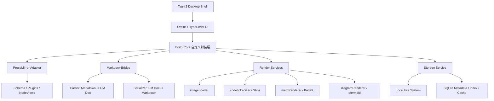

# 基于 ProseMirror 的 Svelte Markdown 编辑器技术架构文档

> 文档日期：2026-05-29\
> 项目方向：一个轻量化 Markdown 阅读编辑器\
> 目标版本：MVP / 第一版架构方案\
> 结论摘要：第一版采用 **Tauri 2 + Svelte + TypeScript + EditorCore 自定义封装层 + ProseMirror + Markdown Parser / Serializer + Shiki / KaTeX / Mermaid + 本地文件系统 / SQLite**。吸收 DOMD 的 Markdown-native、单一数据源、不可变状态、局部渲染、轻量本地体验等思路，但不在第一版自研完整编辑器内核。

---

## 1. 架构结论

第一版建议采用以下架构：

```text
Tauri 2
  ↓
Svelte + TypeScript
  ↓
EditorCore 自定义封装层
  ↓
ProseMirror
  ↓
Markdown Parser / Serializer
  ↓
Shiki / KaTeX / Mermaid
  ↓
本地文件系统 / SQLite
```

核心判断：

1. **ProseMirror 负责编辑行为复杂度**：选区、事务、schema、插件、撤销重做、NodeView、IME、复制粘贴等问题不建议第一版从零实现。
2. **EditorCore 是第一版必须做的封装层**：业务 UI 不直接依赖 ProseMirror API，避免未来内核替换困难。
3. **Markdown 是主数据格式**：保存、导入导出、文件同步都以 Markdown 文本为准。
4. **ProseMirror Doc 是运行时编辑状态**：它服务于编辑过程，不作为长期唯一存储格式。
5. **SQLite 只做辅助数据层**：用于文档索引、最近文件、资源缓存、搜索索引、设置、历史快照，不替代 `.md` 文件本身。
6. **DOMD 思路可吸收，不直接照搬**：DOMD 的 Markdown-native 和轻内核方向值得学习，但第一版自研内核风险过高。

---

## 2. 设计目标

### 2.1 产品目标

本项目不是重型知识库，也不是传统左右分栏 Markdown 编辑器，而是：

> 一个轻量、本地优先、Markdown-first、支持语义编辑体验的桌面 Markdown 阅读与编辑器。

第一版应重点验证：

- Markdown 文件能稳定打开、编辑、保存；
- 写作体验比普通源码编辑器更接近 Typora / Typedown；
- 内核边界清晰，后续可替换 / 扩展；
- 代码块、图片、数学、图表等技术文档能力可以逐步接入；
- 桌面端本地文件体验顺畅。

### 2.2 技术目标

| 目标 | 解释 |
| :--- | :--- |
| Markdown-first | 长期存储以  为准，编辑器状态可随时序列化回 Markdown |
| 内核可替换 | UI 层依赖 EditorCore API，不直接依赖 ProseMirror |
| Svelte 友好 | 提供 Svelte action / store / component 封装 |
| 本地优先 | 文件系统是主存储，SQLite 是索引和元数据辅助 |
| 渲染解耦 | 图片、代码高亮、数学、图表都通过服务接口接入 |
| 主题可配置 | 从第一版使用 CSS 变量管理主题 |
| 风险可控 | 不在 MVP 阶段自研完整编辑器引擎 |

---

## 3. 技术栈选型

### 3.1 总体选型表

| 层级 | 技术 | 职责 | 选择理由 |
| :--- | :--- | :--- | :--- |
| 桌面壳 | Tauri 2 | 窗口、文件系统、原生菜单、系统对话框、SQLite 插件 / Rust 命令 | 适合小体积、本地优先、跨平台桌面应用。Tauri 官方定位是创建 small / fast / secure cross-platform applications。[1] |
| UI 层 | Svelte + TypeScript | 应用界面、侧栏、工具栏、状态栏、设置页、主题切换 | Svelte 通过编译生成高效 JS，组件写法简洁，适合轻量桌面 UI。[2] |
| 编辑器封装 | EditorCore | 对外暴露稳定 API，屏蔽 ProseMirror 细节 | 第一版必须做，避免未来所有业务代码都绑定 ProseMirror |
| 编辑内核 | ProseMirror | 文档模型、事务、选区、插件、NodeView、编辑行为 | 成熟、可扩展，适合构建语义富文本 / Markdown 编辑器 |
| Markdown 桥 | prosemirror-markdown + markdown-it 扩展 | Markdown ↔ ProseMirror Doc 转换 | 提供 CommonMark schema、parser、serializer。[3] |
| 代码高亮 | Shiki | 代码块 token 化与高亮 | Shiki 基于 TextMate grammar，使用与 VS Code 类似的语法高亮能力，并可零运行时渲染。[4] |
| 数学公式 | KaTeX | 行内 / 块级公式渲染 | KaTeX 适合快速同步渲染数学公式，便于本地编辑器集成。[5] |
| 图表 | Mermaid | 文本图表渲染 | Mermaid 使用 Markdown-inspired text definitions 生成图表，适合技术文档。[6] |
| 本地数据 | 文件系统 + SQLite | Markdown 文件、资源、索引、缓存、设置、历史 | SQLite 是 self-contained、serverless、zero-configuration 的事务型数据库引擎。[7] |

---

## 4. 为什么第一版不直接自研 DOMD 式内核

### 4.1 DOMD 的核心思路

DOMD 的公开描述中，最有价值的点包括：

- 从零实现的 Markdown-native WYSIWYG 编辑器引擎；
- 不基于 ProseMirror、Slate、Lexical 等通用富文本框架；
- 数据作为 single source of truth；
- immutable state；
- typing、undo/redo、AI 流式注入、chunked file loading 都建模为同一种 state change；
- 只在变化区域渲染；
- 强调轻量本地文件体验。\[8\]

这些思路非常适合成为本项目的长期架构方向，但不适合作为第一版完整内核实现目标。

### 4.2 自研内核的主要风险

| 风险 | 说明 | MVP 影响 |
| :--- | :--- | :--- |
| 选区模型复杂 | Markdown 文本位置、渲染节点位置、DOM selection 三者映射非常难 | 容易出现光标跳动、输入错位 |
| IME 输入复杂 | 中文输入法 composition 状态需要稳定处理 | 中文场景会直接影响可用性 |
| 撤销重做复杂 | Markdown 原文、语义节点、局部变更都要纳入历史 | 容易产生状态不一致 |
| 列表 / 表格复杂 | Enter、Backspace、Tab、粘贴、嵌套列表都需要大量规则 | 会拖慢 MVP |
| 复制粘贴复杂 | Markdown、HTML、纯文本之间要双向转换 | 难以短期打磨稳定 |
| 插件生态缺失 | 所有扩展都要自己定义协议 | 前期迭代慢 |
| 测试成本高 | 编辑器内核需要大量光标、输入、事务测试 | 超出第一版资源 |
| 许可风险 | DOMD 核心渲染引擎公开说明为 PolyForm Noncommercial，商业使用需要授权。[8] | 不应直接依赖其核心构件 |

### 4.3 正确吸收 DOMD 的方式

第一版不自研完整内核，但可以吸收 DOMD 的经验逻辑：

| DOMD 思路 | 本项目落地方式 |
| :--- | :--- |
| Markdown-native | 保存格式、导入导出、核心 API 都以 Markdown 为中心 |
| single source of truth | 对外以 Markdown 文本为主数据；内部 ProseMirror Doc 是运行时派生状态 |
| immutable state | EditorCore 对外事件使用不可变快照，不暴露可变内部对象 |
| state change 统一建模 | 用户输入、命令、粘贴、图片导入、AI 插入都包装为 EditorCommand / EditorTransaction |
| 局部渲染 | 依赖 ProseMirror 的事务和 NodeView 更新，避免全量重渲染 |
| chunked file loading | 大文件模式先做只读预览 / 分块解析，编辑模式后续增强 |
| 本地极简体验 | 不把账户、云同步、复杂知识库作为 MVP 核心 |

最终策略：

> 第一版不是“自研内核替代 ProseMirror”，而是“用 ProseMirror 作为可替换实现，外面包一层自己的 Markdown-first EditorCore”。

---

## 5. 总体架构



### 5.1 分层说明

| 层 | 说明 | 不能做什么 |
| :--- | :--- | :--- |
| Tauri Shell | 提供桌面能力：文件、路径、窗口、菜单、SQLite、系统对话框 | 不处理编辑器业务逻辑 |
| Svelte UI | 管理界面、布局、状态展示、设置页、工具栏 | 不直接调用 ProseMirror 内部命令 |
| EditorCore | 编辑器统一入口，对外暴露简洁 API | 不绑定具体 UI 框架 |
| ProseMirror Adapter | 将 EditorCore 命令翻译为 ProseMirror transaction | 不向 UI 泄漏 view/state/tr 对象 |
| MarkdownBridge | 负责 Markdown 与编辑状态转换 | 不处理文件系统读写 |
| Render Services | 图片、代码、数学、图表等异步渲染服务 | 不改变文档主数据 |
| Storage Service | 文件、资源、索引、快照、设置 | 不把 SQLite 当作 Markdown 主存储 |

---

## 6. EditorCore 封装层设计

### 6.1 设计原则

EditorCore 是本项目第一版最关键的架构边界。它的目标是：

- 让 Svelte UI 只依赖简单 API；
- 让 ProseMirror 成为内部实现细节；
- 让 Markdown 成为核心输入输出格式；
- 让 imageLoader、codeTokenizer、CSS 变量等能力从一开始成为正式扩展点；
- 为未来自研内核 / DOMD 式内核预留替换空间。

### 6.2 推荐 API 草案

```ts
export interface EditorCoreOptions {
  target: HTMLElement;
  markdown: string;
  readonly?: boolean;
  theme?: EditorThemeOptions;
  imageLoader?: ImageLoader;
  codeTokenizer?: CodeTokenizer;
  mathRenderer?: MathRenderer;
  diagramRenderer?: DiagramRenderer;
  onChange?: (event: EditorChangeEvent) => void;
  onSelectionChange?: (event: EditorSelectionEvent) => void;
  onError?: (error: EditorError) => void;
}

export interface EditorCore {
  mount(target: HTMLElement): void;
  destroy(): void;

  getMarkdown(): string;
  setMarkdown(markdown: string, options?: SetMarkdownOptions): void;

  getSnapshot(): EditorSnapshot;
  restoreSnapshot(snapshot: EditorSnapshot): void;

  focus(): void;
  blur(): void;

  execute(command: EditorCommand): boolean;
  canExecute(command: EditorCommand): boolean;

  updateTheme(theme: EditorThemeOptions): void;
  updateOptions(options: Partial<EditorRuntimeOptions>): void;

  subscribe(listener: EditorListener): () => void;
}
```

### 6.3 命令模型

```ts
export type EditorCommand =
  | { type: 'toggleBold' }
  | { type: 'toggleItalic' }
  | { type: 'toggleCode' }
  | { type: 'setHeading'; level: 1 | 2 | 3 | 4 | 5 | 6 }
  | { type: 'toggleBlockquote' }
  | { type: 'toggleBulletList' }
  | { type: 'toggleOrderedList' }
  | { type: 'toggleTaskList' }
  | { type: 'insertLink'; href: string; title?: string; text?: string }
  | { type: 'insertImage'; src: string; alt?: string; title?: string }
  | { type: 'insertCodeBlock'; language?: string; code?: string }
  | { type: 'insertMathBlock'; tex?: string }
  | { type: 'insertMermaidBlock'; code?: string }
  | { type: 'undo' }
  | { type: 'redo' }
  | { type: 'formatDocument' };
```

### 6.4 快照模型

```ts
export interface EditorSnapshot {
  markdown: string;
  version: number;
  selection?: EditorSelectionSnapshot;
  meta?: Record<string, unknown>;
}
```

第一版快照可以只保存 Markdown + selection 信息，不需要暴露 ProseMirror JSON。这样后续即使底层内核替换，快照协议也相对稳定。

---

## 7. Markdown Parser / Serializer 设计

### 7.1 基础方案

使用 `prosemirror-markdown` 作为基础桥接。它提供：

- 对应 CommonMark 文档模型的 ProseMirror schema；
- Markdown → ProseMirror document 的 parser；
- ProseMirror document → Markdown text 的 serializer。\[3\]

ProseMirror 官方 Markdown 示例也展示了一个关键设计：对外接口仍然可以是 Markdown 文本，内部转换为 ProseMirror document 进行编辑，读取时再序列化回 Markdown。\[9\]

### 7.2 需要扩展的 Markdown 能力

默认 CommonMark 能力不能完全覆盖 Typora / GFM 体验。第一版要评估以下扩展：

| 能力 | 是否建议第一版做 | 实现方式 |
| :--- | :--- | :--- |
| task list | 建议做 | 自定义 schema + markdown-it token rule + serializer rule |
| table | 建议做基础版 | prosemirror-tables + 自定义 Markdown 表格序列化 |
| strikethrough | 建议做 | 自定义 mark |
| front matter | 建议做只读 / 保留 | parse 前切出 YAML front matter，serialize 时放回 |
| footnote | 可延后 | 需要 token、引用跳转、渲染规则 |
| math inline / block | 建议做 | 自定义 node / mark，KaTeX NodeView 渲染 |
| mermaid | 建议做 | fenced code block language = mermaid，NodeView 预览 |
| HTML block | MVP 谨慎 | 可先保留源码，不做完整富文本编辑 |

### 7.3 Markdown 保真策略

Markdown 编辑器常见问题是“保存后格式被重排”。第一版必须明确保真程度：

| 类型 | 策略 |
| :--- | :--- |
| 语义保真 | 必须保证。标题、列表、链接、图片、代码块不能丢 |
| 文本保真 | 尽量保证。用户写的文字、代码、公式不变 |
| 格式保真 | 第一版不承诺 100%。例如空行数量、列表符号、表格对齐可能被规范化 |
| 原始片段保留 | 对 front matter、未知 HTML、未知 fenced block 尽量原样保留 |

建议在架构上保留 `sourceMap` 或 `rawBlock` 概念，为未来更高保真度做准备。

---

## 8. 渲染服务设计

### 8.1 imageLoader

图片是 Markdown 编辑器的核心扩展点，不应散落在 ProseMirror NodeView 和 Svelte UI 中。

```ts
export interface ImageLoader {
  resolve(src: string, context: ImageContext): Promise<ImageResolveResult>;
  import(input: ImageImportInput, context: ImageContext): Promise<ImageImportResult>;
}

export interface ImageResolveResult {
  src: string;
  displaySrc: string;
  exists: boolean;
  width?: number;
  height?: number;
  error?: string;
}

export interface ImageImportResult {
  markdownSrc: string;
  absolutePath?: string;
  width?: number;
  height?: number;
}
```

第一版支持：

- 相对路径解析；
- 绝对路径解析；
- 粘贴图片保存到资源目录；
- 拖放图片复制到资源目录；
- 图片不存在时显示错误占位；
- 不在 Markdown 中写入 base64，除非用户明确选择。

### 8.2 codeTokenizer

代码高亮不应直接写死 Shiki，建议抽象为 tokenizer。

```ts
export interface CodeTokenizer {
  tokenize(input: CodeTokenizeInput): Promise<CodeTokenizeResult>;
}

export interface CodeTokenizeInput {
  code: string;
  language?: string;
  theme?: string;
}

export interface CodeTokenizeResult {
  language?: string;
  tokens: CodeTokenLine[];
  html?: string;
}
```

实现建议：

- 第一版默认 `ShikiCodeTokenizer`；
- 按 `language + theme + codeHash` 缓存；
- 高亮异步执行，先显示纯文本，再更新 token；
- 未识别语言回退到 plain text；
- 主题使用 CSS 变量衔接，而不是把所有颜色硬编码进编辑器。

### 8.3 mathRenderer

数学公式建议用 KaTeX：

```ts
export interface MathRenderer {
  render(tex: string, options: MathRenderOptions): Promise<MathRenderResult>;
}
```

第一版建议：

- 支持 `$inline$`；
- 支持 `$$block$$`；
- 错误公式显示错误提示，不破坏原文；
- 光标进入公式时可切回源码编辑；
- 不急于做公式自动编号。

### 8.4 diagramRenderer

Mermaid 建议作为 fenced code block 的特殊渲染：

````markdown

````

````

第一版建议：

- 代码块语言为 `mermaid` 时渲染图表预览；
- 支持源码 / 预览切换；
- 渲染失败显示错误信息；
- 注意 Mermaid SVG 安全策略，避免不可信脚本注入。

---

## 9. CSS 变量主题系统

### 9.1 主题原则

第一版就要使用 CSS 变量，原因是：

- Svelte UI、ProseMirror 编辑区、代码高亮、数学公式、图表容器需要统一主题；
- 未来支持用户自定义主题时不需要重构；
- 暗色 / 浅色模式可以统一切换；
- 与 Typora 的 CSS 自定义主题思路一致。

### 9.2 变量草案

```css
:root {
  --md-editor-bg: #ffffff;
  --md-editor-fg: #1f2328;
  --md-editor-muted-fg: #6a737d;
  --md-editor-border: #d0d7de;
  --md-editor-selection-bg: rgba(80, 140, 255, 0.25);

  --md-editor-heading-fg: var(--md-editor-fg);
  --md-editor-link-fg: #0969da;
  --md-editor-blockquote-border: #d0d7de;
  --md-editor-blockquote-fg: #57606a;

  --md-editor-code-bg: #f6f8fa;
  --md-editor-code-fg: #24292f;
  --md-editor-code-border: #d0d7de;

  --md-editor-table-border: #d0d7de;
  --md-editor-table-header-bg: #f6f8fa;

  --md-editor-radius-sm: 4px;
  --md-editor-radius-md: 8px;
  --md-editor-font-body: system-ui, sans-serif;
  --md-editor-font-mono: ui-monospace, SFMono-Regular, Menlo, Consolas, monospace;
  --md-editor-font-size: 16px;
  --md-editor-line-height: 1.7;
}
````

### 9.3 主题范围

| 区域 | 是否走 CSS 变量 |
| :--- | :--- |
| 应用背景 | 是 |
| 编辑区背景 / 文字 | 是 |
| 标题 / 段落 / 链接 | 是 |
| 引用块 | 是 |
| 表格 | 是 |
| 代码块 | 是 |
| 行内代码 | 是 |
| 选区 | 是 |
| 光标 | 是 |
| Mermaid 容器 | 是 |
| KaTeX 容器 | 是 |
| 浮动工具栏 | 是 |

---

## 10. 数据与存储架构

### 10.1 数据分层

| 数据类型 | 主存储 | 说明 |
| :--- | :--- | :--- |
| Markdown 正文 | 本地  文件 | 项目的主数据，必须可脱离应用独立存在 |
| 图片 / 附件 | 本地资源目录 | 默认与文档同级或工作区  目录 |
| 文档元信息 | SQLite | 最近打开、标题缓存、字数、修改时间、标签等 |
| 搜索索引 | SQLite FTS | 可选，用于全文搜索 |
| 渲染缓存 | SQLite / 文件缓存 | 代码高亮、图片尺寸、Mermaid 渲染状态等 |
| 用户设置 | SQLite / JSON | 主题、字体、快捷键、默认目录 |
| 历史快照 | SQLite / 文件 | 可选，避免覆盖误保存 |

### 10.2 SQLite 表设计草案

```sql
CREATE TABLE documents (
  id TEXT PRIMARY KEY,
  path TEXT NOT NULL UNIQUE,
  title TEXT,
  content_hash TEXT,
  modified_at INTEGER,
  indexed_at INTEGER,
  word_count INTEGER DEFAULT 0,
  status TEXT DEFAULT 'active'
);

CREATE TABLE document_assets (
  id TEXT PRIMARY KEY,
  document_id TEXT NOT NULL,
  markdown_src TEXT NOT NULL,
  absolute_path TEXT,
  kind TEXT,
  width INTEGER,
  height INTEGER,
  content_hash TEXT,
  created_at INTEGER,
  FOREIGN KEY (document_id) REFERENCES documents(id)
);

CREATE TABLE document_snapshots (
  id TEXT PRIMARY KEY,
  document_id TEXT NOT NULL,
  content_hash TEXT NOT NULL,
  markdown TEXT NOT NULL,
  created_at INTEGER,
  reason TEXT,
  FOREIGN KEY (document_id) REFERENCES documents(id)
);

CREATE TABLE app_settings (
  key TEXT PRIMARY KEY,
  value_json TEXT NOT NULL,
  updated_at INTEGER
);
```

### 10.3 文件系统策略

建议默认规则：

```text
文档.md
文档.assets/
  image-001.png
  image-002.jpg
```

或在工作区模式下：

```text
workspace/
  docs/
    a.md
    b.md
  .md-editor/
    index.sqlite
    cache/
  assets/
    a/
      image-001.png
```

第一版建议优先支持“文档同级 assets 目录”，简单、直观、便于迁移。

---

## 11. Svelte 集成方案

### 11.1 Svelte action

```ts
export function markdownEditor(node: HTMLElement, options: EditorCoreOptions) {
  const editor = createEditorCore({ ...options, target: node });

  return {
    update(nextOptions: EditorCoreOptions) {
      editor.updateOptions(nextOptions);
    },
    destroy() {
      editor.destroy();
    },
  };
}
```

组件使用：

```svelte
<script lang="ts">
  import { markdownEditor } from '$lib/editor-svelte';
  export let markdown = '';
</script>

<div class="editor-host" use:markdownEditor={{ markdown }} />
```

### 11.2 Store 设计

```ts
export interface EditorStoreState {
  markdown: string;
  dirty: boolean;
  wordCount: number;
  selection: EditorSelectionState | null;
  activeMarks: string[];
  activeBlock: string | null;
  errors: EditorError[];
}
```

Svelte UI 可以订阅 EditorCore 事件更新状态栏、工具栏、目录等，不直接读取 ProseMirror state。

---

## 12. ProseMirror Adapter 设计

### 12.1 内部模块

```text
editor-prosemirror/
  createProseMirrorEditor.ts
  schema/
    baseSchema.ts
    tableSchema.ts
    taskListSchema.ts
    mathSchema.ts
  plugins/
    historyPlugin.ts
    keymapPlugin.ts
    pastePlugin.ts
    inputRulesPlugin.ts
    markdownShortcutPlugin.ts
    imagePlugin.ts
    codeBlockPlugin.ts
  nodeviews/
    ImageNodeView.ts
    CodeBlockNodeView.ts
    MathNodeView.ts
    MermaidNodeView.ts
  bridge/
    parser.ts
    serializer.ts
    preserveRaw.ts
```

### 12.2 插件优先级

| 插件 | MVP 优先级 | 说明 |
| :--- | :--- | :--- |
| history | P0 | 撤销 / 重做 |
| keymap | P0 | 快捷键 |
| inputRules | P0 | 、、、``` 等 Markdown 快捷输入 |
| paste | P0 | Markdown / HTML / plain text 粘贴 |
| image | P1 | 图片解析、预览、导入 |
| codeBlock | P1 | 代码块语言、Shiki 高亮 |
| outline | P1 | 标题提取 |
| table | P1 | 基础表格 |
| math | P1 | KaTeX |
| mermaid | P1 | Mermaid 预览 |
| collaboration | 不做 | 轻量本地编辑器第一版不需要 |

---

## 13. MVP 范围

### 13.1 第一版必须完成

| 模块 | 功能 |
| :--- | :--- |
| 桌面壳 | 打开文件、保存文件、另存为、最近文件 |
| 编辑器 | ProseMirror 编辑、Markdown 解析 / 序列化、撤销重做 |
| EditorCore | 、、、、 |
| Markdown | 标题、段落、列表、引用、链接、图片、代码块、粗体、斜体、行内代码 |
| Svelte UI | 编辑区、工具栏、状态栏、文件标题、dirty 状态 |
| 渲染 | 图片预览、基础代码高亮、CSS 变量主题 |
| 存储 | 本地文件主存储、SQLite 保存最近文件 / 设置 |
| 稳定性 | 中文 IME、复制粘贴、文件编码、异常提示 |

### 13.2 第一版建议完成

| 模块 | 功能 |
| :--- | :--- |
| Markdown | task list、基础表格、front matter 保留 |
| 渲染 | KaTeX、Mermaid |
| 导航 | Outline |
| 体验 | 专注模式、打字机模式、字数统计 |
| 图片 | 粘贴图片保存到 assets 目录 |

### 13.3 第一版暂不做

| 功能 | 原因 |
| :--- | :--- |
| 多人协作 | 与本地轻量定位不一致 |
| 云同步 | 可交给系统云盘 / Git，后续再做 |
| 插件市场 | 先内部模块化即可 |
| 完整导出 docx / epub | 工程成本高 |
| 自研完整编辑器内核 | 风险过高，先用 EditorCore 隔离 |
| AI 深度写作流 | 等 EditorCore command / transaction 稳定后再接入 |

---

## 14. 项目目录建议

```text
src/
  app/
    App.svelte
    routes/
    stores/
    themes/
  editor-core/
    index.ts
    types.ts
    commands.ts
    events.ts
    createEditorCore.ts
  editor-prosemirror/
    adapter.ts
    schema/
    plugins/
    nodeviews/
    markdown/
  editor-svelte/
    MarkdownEditor.svelte
    useMarkdownEditor.ts
    editorStore.ts
  services/
    storage/
      fileStorage.ts
      sqliteStorage.ts
      documentRepository.ts
    render/
      imageLoader.ts
      shikiCodeTokenizer.ts
      katexRenderer.ts
      mermaidRenderer.ts
    outline/
      outlineService.ts
  desktop/
    tauriCommands.ts
    fileDialog.ts
    recentFiles.ts
src-tauri/
  src/
    main.rs
    commands/
      fs.rs
      sqlite.rs
      path.rs
```

---

## 15. 开发路线图

### 15.1 阶段一：可编辑闭环

目标：证明 Markdown 文件可以稳定进入编辑器并保存回去。

- 建立 Tauri + Svelte + TypeScript 项目。
- 接入 ProseMirror。
- 实现 EditorCore 最小 API。
- 实现 Markdown parse / serialize。
- 支持打开 / 保存 `.md`。
- 支持基础 Markdown 节点。

验收标准：

- 打开一个 Markdown 文件；
- 编辑标题、段落、列表、代码块；
- 保存后用其他编辑器打开内容正确；
- 不出现明显中文输入问题。

### 15.2 阶段二：Markdown-first 体验增强

目标：让它不只是一个 ProseMirror demo。

- Markdown 快捷输入规则；
- 源码模式 / 语义编辑模式切换；
- imageLoader；
- codeTokenizer + Shiki；
- CSS 变量主题；
- dirty 状态、字数统计、Outline。

验收标准：

- 图片拖入后可预览并保存相对路径；
- 代码块可高亮；
- 切换主题不破坏编辑区；
- Outline 可跟随文档更新。

### 15.3 阶段三：技术文档能力

目标：适合技术文档和项目笔记。

- KaTeX；
- Mermaid；
- task list；
- 基础表格；
- Front Matter 保留；
- SQLite 最近文件和索引。

验收标准：

- 数学公式能编辑和渲染；
- Mermaid 能预览和报错提示；
- 表格能基础编辑并保存为 Markdown；
- 最近文件和设置能跨启动保存。

### 15.4 阶段四：长期内核探索

目标：为可能的自研内核做准备，而不是影响 MVP。

- 记录 EditorCore API 使用情况；
- 抽象内部 transaction / command；
- 建立 Markdown source map 实验；
- 大文件只读 / 分块预览实验；
- 探索 DOMD 式数据驱动渲染模型。

---

## 16. 风险与对策

| 风险 | 表现 | 对策 |
| :--- | :--- | :--- |
| Markdown 序列化不保真 | 保存后空行、表格、列表格式变化 | 明确保真等级；保留 raw block；增加测试用例 |
| ProseMirror 侵入 UI | Svelte 组件里到处使用 | 所有调用必须走 EditorCore |
| GFM 扩展复杂 | task、table、footnote 难以与 CommonMark schema 对齐 | 先做最常用子集，复杂能力后置 |
| 中文 IME 问题 | 输入时光标跳动、字符丢失 | 单独做中文输入测试；避免在 composition 中强制重渲染 |
| Shiki 异步性能 | 大代码块高亮卡顿 | 异步高亮、缓存、降级 plain text |
| Mermaid 安全问题 | SVG / HTML 注入 | 使用安全模式、隔离容器、限制不可信内容 |
| SQLite 过度设计 | 把文档主数据塞进数据库 | 明确  文件是主存储，SQLite 只做辅助 |
| 自研内核诱惑 | 过早投入底层模型导致 MVP 延迟 | 第一版只做封装层和实验，不替换 ProseMirror |

---

## 17. 测试清单

### 17.1 编辑行为测试

- [ ] 中文输入法连续输入。
- [ ] 中文输入法在粗体、标题、列表中输入。
- [ ] Enter 创建新段落。
- [ ] 列表中 Enter / Backspace / Tab / Shift+Tab。
- [ ] 代码块中 Enter 和 Tab。
- [ ] 撤销 / 重做。
- [ ] 多选后加粗 / 链接 / 引用。
- [ ] 粘贴 Markdown。
- [ ] 粘贴 HTML。
- [ ] 粘贴纯文本。
- [ ] 拖放图片。
- [ ] 保存后重新打开。

### 17.2 Markdown 保真测试

- [ ] 标题层级。
- [ ] 嵌套列表。
- [ ] task list。
- [ ] 表格。
- [ ] fenced code block language。
- [ ] front matter。
- [ ] 图片相对路径。
- [ ] 链接 title。
- [ ] 行内代码中的特殊字符。
- [ ] 数学公式中的反斜杠。
- [ ] Mermaid 代码块。

### 17.3 桌面测试

- [ ] Windows 路径。
- [ ] macOS 路径。
- [ ] 文件名中文。
- [ ] 路径包含空格。
- [ ] 文件被外部修改。
- [ ] 保存权限不足。
- [ ] 图片文件丢失。
- [ ] 最近文件不存在。

---

## 18. 最终建议

本项目第一版应坚定采用：

> **基于 ProseMirror 的 Svelte Markdown 编辑器 + 自定义 EditorCore 封装层。**

不要把第一版目标设为“重写 ProseMirror”，而要把目标设为：

1. 做出自己的 Editor API；
2. 做出 Markdown-first 的数据流；
3. 做好 imageLoader、codeTokenizer、CSS 变量等扩展点；
4. 让业务 UI 与底层编辑器解耦；
5. 用 ProseMirror 承担复杂编辑行为；
6. 用 Tauri 2 做轻量桌面本地文件体验；
7. 用 SQLite 做索引、缓存、设置和快照，而不是主文档存储。

这样第一版既能快速落地，又不会把未来锁死在 ProseMirror 上。

---

## 19. 资料来源

\[1\] Tauri 2 官方站点：https://v2.tauri.app/\
\[2\] Svelte 官方站点：https://svelte.dev/\
\[3\] prosemirror-markdown：https://github.com/ProseMirror/prosemirror-markdown\
\[4\] Shiki 官方站点：https://shiki.style/\
\[5\] KaTeX 官方站点：https://katex.org/\
\[6\] Mermaid 官方站点：https://mermaid.js.org/\
\[7\] SQLite 官方说明：https://sqlite.org/about.html\
\[8\] DOMD GitHub 仓库：https://github.com/do-md/domd\
\[9\] ProseMirror Markdown 示例：https://prosemirror.net/examples/markdown/

