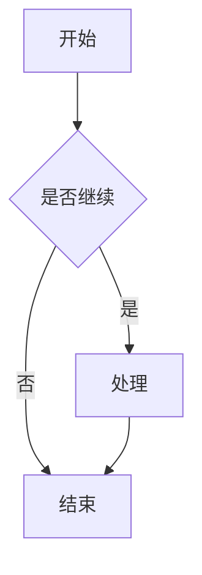
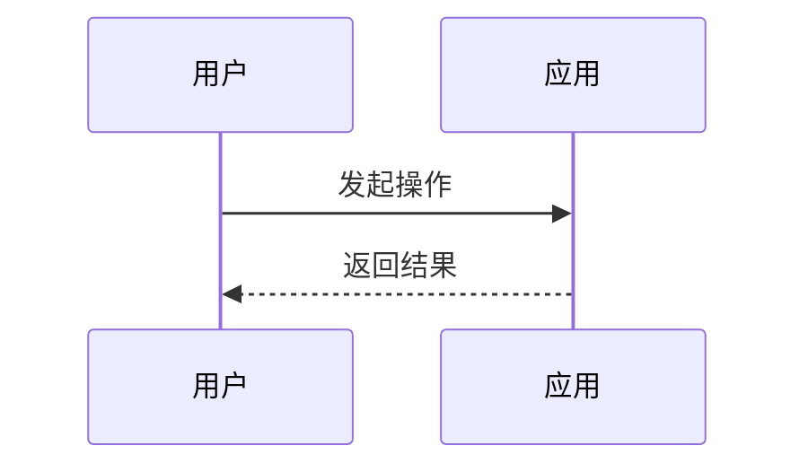
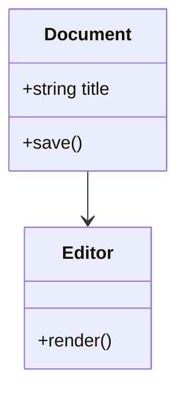
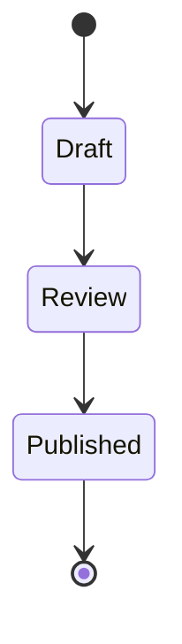
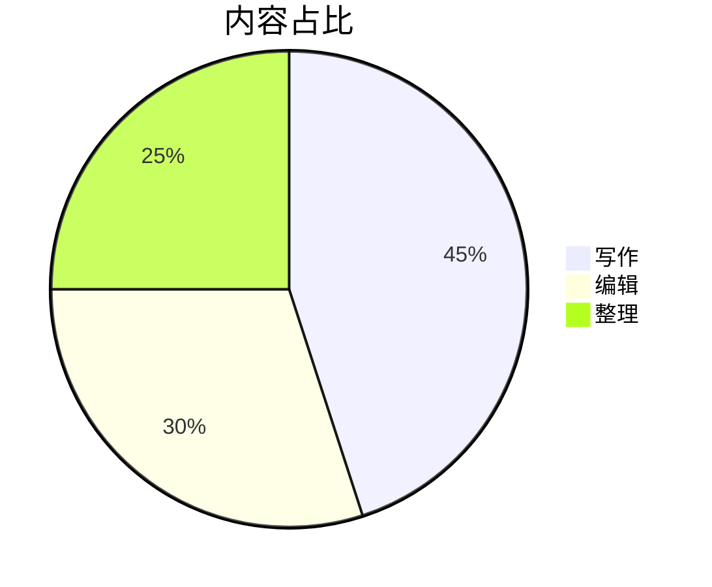
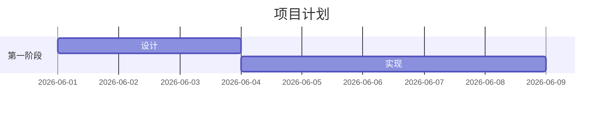
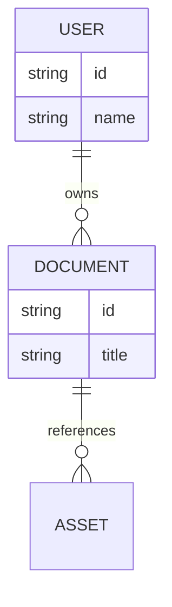

# Nomo Markdown 全元素实例

这份文档用于在 Nomo 中验收 **Markdown-first** 的编辑体验：同一份 `.md` 文本既能在语义编辑中直接操作标题、列表、表格、代码、公式和图表，也能在源码模式中保持可读、可迁移、可手工维护。

它不是功能清单的堆叠，而是一份可打开、可编辑、可保存的样例文档。阅读时可以按节点逐段检查：每个节点都包含示例、保存形式、插入入口、编辑交互和常用快捷键。

## Front matter 元数据

文档开头的 YAML front matter 会被 Nomo 保留，用来描述标题、作者、标签等元信息。它属于文档元数据，不是正文语义节点，也不参与正文目录。

| 操作项 | 说明 |
| :--- | :--- |
| 保存形式 | 文档最开头由 `---` 包裹的 YAML 块 |
| 插入 / 转换 | 段落菜单的“文档元数据”；也可在源码模式手写 YAML front matter |
| 编辑交互 | 编辑器应保留该元数据块，不把它当作普通正文、标题或代码块处理 |
| 常用快捷键 | 无 |

## 正文目录节点

<!-- toc -->
- [Nomo Markdown 全元素实例](#nomo-markdown-全元素实例)
  - [Front matter 元数据](#front-matter-元数据)
  - [正文目录节点](#正文目录节点)
  - [标题节点](#标题节点)
- [一级标题示例](#一级标题示例)
  - [二级标题示例](#二级标题示例)
    - [三级标题示例](#三级标题示例)
      - [四级标题示例](#四级标题示例)
        - [五级标题示例](#五级标题示例)
          - [六级标题示例](#六级标题示例)
  - [段落与行内标记](#段落与行内标记)
  - [列表节点](#列表节点)
  - [引用与提示块节点](#引用与提示块节点)
  - [表格节点](#表格节点)
  - [代码块节点](#代码块节点)
  - [数学公式节点](#数学公式节点)
  - [Mermaid 图表节点](#mermaid-图表节点)
  - [图片节点](#图片节点)
  - [HTML 与注释节点](#html-与注释节点)
  - [脚注节点](#脚注节点)
  - [水平分割线节点](#水平分割线节点)
  - [应用级操作速查](#应用级操作速查)
    - [文件与窗口](#文件与窗口)
    - [视图与偏好](#视图与偏好)
<!-- /toc -->

正文 TOC 块由独占行 `<!-- toc -->` 和 `<!-- /toc -->` 包裹，中间目录项从当前 Markdown 标题派生。它不是普通 Markdown 注释，也不同于侧边的 Outline；它是正文中的导航节点，保存时仍保留为 Markdown 文本。

```md
<!-- toc -->
...目录项由标题生成...
<!-- /toc -->
```

| 操作项 | 说明 |
| :--- | :--- |
| 保存形式 | `<!-- toc -->` 与 `<!-- /toc -->` 包裹的 Markdown 列表 |
| 插入 / 转换 | 段落菜单或工具栏“正文目录”按钮 |
| 编辑交互 | 目录块自身不可直接编辑；点击目录项跳转到对应标题；目录块上的删除按钮可移除目录 |
| 常用快捷键 | 无 |

## 标题节点

# 一级标题示例

## 二级标题示例

### 三级标题示例

#### 四级标题示例

##### 五级标题示例

###### 六级标题示例

标题用于组织长文档结构。Nomo 会从标题派生 Outline 和正文 TOC 块，因此标题层级应表达内容结构，而不是只用来放大文字。

| 操作项 | 说明 |
| :--- | :--- |
| 保存形式 | `#` 到 `######` |
| 插入 / 转换 | 段落菜单的标题子菜单；工具栏标题按钮；源码模式输入 `# ` 到 `###### ` |
| 编辑交互 | 可提升或降低标题层级；参与 Outline 和正文 TOC 块；标题正文仍可使用部分行内 mark |
| 常用快捷键 | `Ctrl + 1` 到 `Ctrl + 6`、`Ctrl + =`、`Ctrl + -` |

## 段落与行内标记

普通段落用于承载正文。行内标记适合表达局部语义：**加粗** 表示强调，*斜体* 表示轻强调，~~删除线~~ 表示废弃内容，<u>下划线</u> 表示额外标记，<mark>高亮</mark> 表示重点，`行内代码` 表示代码片段，$x + y = z$ 表示行内公式，[带标题的链接](https://example.com/docs "文档入口") 表示外部引用。

HTML 行内标签示例：**strong**、*em*、<u>u</u>、~~s~~、~~del~~、`code`、[HTML a 标签](https://example.com "HTML 链接")。

相邻行内代码示例：``` alpha``beta ```。保存时会使用内部占位策略，避免两个行内代码粘在一起后无法重新解析。

行内代码渲染默认开启，可在偏好设置中关闭；关闭后语义编辑区会显示原始 Markdown 反引号写法，例如 `` `行内代码` ``。

硬换行示例：这一行末尾有两个空格。\
这一行应紧跟上一行显示，但仍属于同一个段落的换行效果。

| 操作项 | 说明 |
| :--- | :--- |
| 保存形式 | 普通段落用空行分隔；行内 mark 保存为 Markdown 或安全 HTML，例如 `**加粗**`、`*斜体*`、`~~删除线~~`、`<u>下划线</u>`、`<mark>高亮</mark>`、``行内代码``、`$x$`、`[文本](地址 "标题")` |
| 插入 / 转换 | 直接输入正文；格式菜单或工具栏切换行内样式；源码模式输入对应 Markdown |
| 编辑交互 | 选区上切换 mark；空光标点击格式按钮会进入待定行内格式，继续输入自动带格式；清除样式只移除行内表现，不改变标题、列表、引用、表格等块级结构 |
| 常用快捷键 | 段落 `Ctrl + 0`；加粗 `Ctrl + B`；斜体 `Ctrl + I`；删除线 `Alt + Shift + 5`；下划线 `Ctrl + U`；链接 `Ctrl + K`；行内代码 `Ctrl + ``；清除样式 `Ctrl + </code>` |

## 列表节点

- 无序列表第一项
  - 无序列表第二层
- 无序列表第二项

1. 有序列表第一项
2. 有序列表第二项
   1. 有序列表第二层
   2. 有序列表第二层继续

- [x] 已完成任务项
- [ ] 未完成任务项
- [ ] 任务列表仍是 Markdown `- [ ]` / `- [x]` 文本，不是项目管理任务。

列表适合把步骤、清单和轻量任务拆开。Task List 只是 Markdown 文本表达的轻量任务清单，不会变成 Issue、日程或项目管理对象。

| 操作项 | 无序列表 | 有序列表 | 任务列表 |
| :--- | :--- | :--- | :--- |
| 保存形式 | `-`、`*`、`+` | `1.`、`2.` | `- [ ]` / `- [x]` |
| 插入 / 转换 | 段落菜单或工具栏列表按钮；源码模式输入列表标记 | 段落菜单；源码模式输入数字列表 | 段落菜单或工具栏任务列表按钮 |
| 编辑交互 | 支持嵌套；`Tab` 缩进，`Shift + Tab` 提升层级 | 支持嵌套；序号由 Markdown 结构表达 | 点击 checkbox 可切换完成状态，本质仍保存为 Markdown 列表文本 |
| 常用快捷键 | `Ctrl + Shift + ]` | `Ctrl + Shift + [` | `Ctrl + Shift + X` |

## 引用与提示块节点

> 普通引用块用于保留引用语义。多行引用会保持在同一个引用区域。

> [!NOTE]
> 提醒：适合写一般说明。

> [!TIP]
> 建议：适合写推荐做法。

> [!IMPORTANT]
> 重要：适合写必须关注的决定。

> [!WARNING]
> 警告：适合写可能出错的场景。

> [!CAUTION]
> 风险：适合写破坏性或高风险动作。

普通引用适合引用外部文本或上下文说明。Callout 使用 GitHub Alert 语法表达语义化提示，支持 note、tip、important、warning、caution 五种固定类型。

| 操作项 | 普通引用 | Callout 提示块 |
| :--- | :--- | :--- |
| 保存形式 | 每行前缀 `>` | `> [!NOTE]`、`> [!TIP]`、`> [!IMPORTANT]`、`> [!WARNING]`、`> [!CAUTION]` |
| 插入 / 转换 | 段落菜单或工具栏引用按钮；源码模式输入 `>` | 段落菜单或工具栏提示块按钮；源码模式输入 GitHub Alert 语法 |
| 编辑交互 | 再次切换引用可取消引用包裹 | 正文区域可编辑；可切换类型或取消提示块；普通引用不会自动转换为 Callout |
| 常用快捷键 | `Ctrl + Shift + Q` | `Ctrl + Shift + A` |

## 表格节点

| 元素 | 状态 | 说明 |
| :--- | :---: | ---: |
| 基础表格 | 可编辑 | 使用 Markdown pipe table 保存 |
| 表头行 | 可切换 | 第一行可作为 header |
| 对齐 | 左 / 中 / 右 | 分隔行使用 `:---`、`:---:`、`---:` |
| 行列操作 | 可插入 / 删除 | 语义模式中显示表格内联控件 |

基础表格适合写轻量二维信息，不承担电子表格的计算、筛选或复杂布局能力。Markdown 主内容只保存 pipe table，表格内联控件只是编辑时的交互入口。

| 操作项 | 说明 |
| :--- | :--- |
| 保存形式 | Markdown pipe table |
| 插入 / 转换 | 段落菜单或工具栏表格按钮；表格尺寸选择器 |
| 编辑交互 | 光标在表格内显示内联控件；可插入 / 删除行列、设置列对齐、切换表头行、删除整表 |
| 常用快捷键 | `Ctrl + Shift + T`；表格内 `Ctrl + Enter` 插入下方行，`Ctrl + Shift + Enter` 插入上方行 |

## 代码块节点

```ts title="src/example.ts"
type MarkdownElement = {
  name: string;
  node: string;
  savedAsMarkdown: boolean;
};

const element: MarkdownElement = {
  name: '代码块',
  node: 'code_block',
  savedAsMarkdown: true,
};

console.log(element);
```

```diff title="example.diff"
- const mode = 'preview';
+ const mode = 'semantic';
+ const sourceMode = 'source';
```

```powershell title="windows-first.ps1"
$root = "D:\Demo\Nomo"
Write-Output "Nomo works in $root"
```

代码块用于保存多行源码、命令、补丁或配置片段。它仍是 fenced code block，不是可执行脚本；语义编辑中的复制按钮、语言选择器和编辑态只服务于阅读与写作。

| 操作项 | 说明 |
| :--- | :--- |
| 保存形式 | fenced code block，例如 `ts</code> 到 <code>` |
| 插入 / 转换 | 段落菜单或工具栏代码块按钮；源码模式输入三个反引号 |
| 编辑交互 | 点击进入编辑态；复制按钮复制代码；右下角语言选择器切换语言；失焦保存；`Esc` 放弃本次编辑 |
| 常用快捷键 | `Ctrl + Shift + K`；编辑态 `Ctrl + Enter` 保存并下插段落，`Ctrl + Shift + Enter` 保存并上插段落 |

## 数学公式节点

行内公式示例：$E = mc^2$，以及带转义美元符的公式 $price = 100\$ + fee$。

$$
\int_0^1 x^2 dx = \frac{1}{3}
$$

$$
\begin{aligned}
a^2 + b^2 &= c^2 \\
f(x) &= \sum_{n=0}^{\infty} \frac{x^n}{n!}
\end{aligned}
$$

数学公式使用 TeX 文本作为主数据，并由 KaTeX 渲染。行内公式适合嵌入句子，公式块适合展示推导过程或多行表达式。

| 操作项 | 行内公式 | 公式块 |
| :--- | :--- | :--- |
| 保存形式 | `$E = mc^2$` | `$$` 包裹的 TeX 块 |
| 插入 / 转换 | 源码模式输入 `$...$` | 段落菜单或工具栏数学公式按钮；源码模式输入 `$$` 后回车或完整公式块 |
| 编辑交互 | 点击进入单输入框编辑态；`Enter` 保存；`Esc` 放弃；边界方向键退出到节点前后 | 点击进入多行编辑态；普通 `Enter` 在公式内换行；`Esc` 放弃本次编辑 |
| 常用快捷键 | 无 | `Ctrl + Shift + M`；编辑态 `Ctrl + Enter` 保存并下插段落，`Ctrl + Shift + Enter` 保存并上插段落 |

## Mermaid 图表节点















Mermaid 图表适合技术文档中的流程、时序、状态、类关系、甘特图和 ER 图。Nomo 保存的是 fenced code block 中的 Mermaid 源码，预览只是从文本派生出来的渲染结果。

| 操作项 | 说明 |
| :--- | :--- |
| 保存形式 | ````mermaid` fenced code block |
| 插入 / 转换 | 段落菜单图表子菜单或工具栏图表按钮；可插入空白图表，也可从流程图、时序图、类图、状态图、饼图、甘特图、ER 图模板开始 |
| 编辑交互 | 点击图表进入源码编辑态；编辑态上方写源码、下方看预览；全屏按钮可放大查看；`Esc` 关闭全屏或放弃编辑 |
| 常用快捷键 | 无 |

## 图片节点

<p align="center">
  
</p>

图片节点保存为标准 Markdown 图片语法， 支持 `left`、`center`、`right`；`width` 支持像素数字或百分比。

本地图片建议使用相对路径，让 Markdown 文件和资源目录一起迁移时仍能正常显示。图片资源策略决定导入目标，但 Markdown 主内容只保存路径或 URL。

| 操作项 | 说明 |
| :--- | :--- |
| 保存形式 | `{align=center width=160}` |
| 插入 / 转换 | 图片 Markdown 语法；图片导入流程写入路径后成为图片节点；格式菜单也提供图像入口 |
| 编辑交互 | 双击或全屏按钮查看；右键可设置对齐、尺寸、打开所在位置、复制图片、复制路径、删除 |
| 常用快捷键 | 全屏中 `Ctrl + 滚轮` 缩放，拖动平移，`Esc` 关闭 |

## HTML 与注释节点

<section class="demo-html-block" id="editable-html-demo">
  <strong>可编辑 HTML 块：</strong>当前支持 section / div 作为块级根标签，并允许部分安全内联标签。
</section>

<!-- 块级注释：语义编辑中应显示为低调注释卡片，保存时仍保留 Markdown 注释语义。 -->

不可编辑或危险 HTML 不应作为可编辑节点处理。示例中不放置 `script`、`iframe`、`form` 等标签。

Markdown 注释和 HTML 块源码外形相近，但语义不同：Markdown 注释是作者备注，语义编辑中以低调卡片或标签呈现；HTML 块是保留或渲染的结构化 HTML 内容。

| 操作项 | HTML 块 | Markdown 注释 |
| :--- | :--- | :--- |
| 保存形式 | 安全 HTML 块，例如 `<section>...</section>` 或 `<div>...</div>` | `<!-- 注释内容 -->` |
| 插入 / 转换 | 源码模式输入安全 HTML 块 | 行内注释通过格式菜单或工具栏注释按钮；块级注释通过段落菜单注释块；源码模式输入 Markdown 注释 |
| 编辑交互 | 只允许安全可编辑 HTML；根标签支持 `section` / `div`，内容区可编辑 | 行内注释点击标签进入编辑态；块级注释点击卡片编辑完整注释；`Enter` 或失焦保存；`Esc` 放弃 |
| 常用快捷键 | 无 | 无 |

## 脚注节点

正文里的脚注引用示例[^1]。脚注引用应能跳转到底部定义，底部定义仍可编辑。

[^1]: 这是脚注定义内容，保存时使用 `[^id]: 内容` 语法。

脚注适合补充不想打断正文节奏的说明。它不是悬浮批注，也不是数据库注释；正文引用和底部定义都属于 Markdown 主内容。

| 操作项 | 说明 |
| :--- | :--- |
| 保存形式 | 正文引用 `[^id]`，底部定义 `[^id]: 内容` |
| 插入 / 转换 | 段落菜单或工具栏脚注按钮；源码模式输入脚注引用和定义 |
| 编辑交互 | 点击正文脚注引用跳转到底部定义；底部定义内容可编辑 |
| 常用快捷键 | 无 |

## 水平分割线节点

---

上方是水平分割线节点。源码中输入 `---`、`___` 或 `***` 后回车，也可转换为水平分割线。

| 操作项 | 说明 |
| :--- | :--- |
| 保存形式 | `---`、`___` 或 `***` |
| 插入 / 转换 | 段落菜单；源码模式输入分割线标记后回车 |
| 编辑交互 | 点击选中整个节点；`Delete` 可删除 |
| 常用快捷键 | `Ctrl + Shift + H` |

## 应用级操作速查

这一节只记录不属于 Markdown 节点的应用级操作。它们影响文件、窗口、视图和偏好，不应和正文 TOC 块、Outline 或资源管理器混为同一种概念。

### 文件与窗口

| 操作 | 入口 | 快捷键 |
| :--- | :--- | :--- |
| 新建 Markdown | 文件菜单 | `Ctrl + N` |
| 新建窗口 | 文件菜单 | `Ctrl + Shift + N` |
| 打开文件 | 文件菜单 | `Ctrl + O` |
| 打开文件夹 | 文件菜单 | `Ctrl + Shift + O` |
| 打开最近 | 文件菜单的最近列表 | 无 |
| 保存 | 文件菜单 | `Ctrl + S` |
| 另存为 | 文件菜单 | `Ctrl + Shift + S` |
| 关闭当前文件 | 文件菜单 | `Ctrl + W` |
| 关闭窗口 | 文件菜单或窗口关闭按钮 | `Alt + F4` |
| 退出应用 | 文件菜单 | 无 |

### 视图与偏好

| 操作 | 入口 | 快捷键 |
| :--- | :--- | :--- |
| 切换语义编辑 / 源码模式 | 查看菜单或工具栏模式按钮 | `Ctrl + E` |
| 显示 / 隐藏文档大纲 | 查看菜单或工具栏大纲按钮 | 无 |
| 切换主题 | 查看菜单或标题栏主题按钮 | `Ctrl + Shift + L` |
| 显示 / 隐藏资源管理器 | 查看菜单或标题栏按钮 | `Ctrl + Shift + F` |
| 调整内容宽度 | 工具栏宽度滑块 | 无 |

