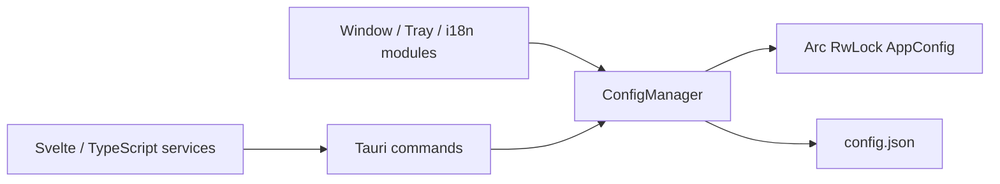

# Design: Replace SQLite With JSON Config

## 1. Architecture
The backend introduces a unified JSON-backed configuration module that replaces the SQLite `database` module as the persistence boundary.



- `ConfigManager` is managed as Tauri state and is the only backend component allowed to read or write `config.json`.
- Frontend code keeps using the existing `tauriStorage.ts` facade where possible to minimize UI churn.
- Backend window, tray, external-open, and i18n code read/update configuration through typed helper APIs instead of SQL helper functions.
- The old `database` module is removed or replaced by a non-SQL compatibility command module only if needed during the transition.

## 2. Data Model & Interfaces
The canonical backend data model is grouped by responsibility instead of storing all values as flat database rows.

```rust
#[derive(Clone, Debug, Serialize, Deserialize)]
#[serde(default)]
pub struct AppConfig {
    pub app: AppSection,
    pub editor: EditorSection,
    pub window: WindowSection,
    pub recent: RecentSection,
    pub workspace: WorkspaceSection,
    pub snapshots: SnapshotSection,
}

#[derive(Clone, Debug, Serialize, Deserialize)]
#[serde(default)]
pub struct AppSection {
    pub theme: serde_json::Value,
    pub interface_language: serde_json::Value,
    pub close_behavior: serde_json::Value,
    pub preferences: BTreeMap<String, serde_json::Value>,
}

#[derive(Clone, Debug, Serialize, Deserialize)]
#[serde(default)]
pub struct EditorSection {
    pub font_size: serde_json::Value,
    pub line_height: serde_json::Value,
    pub content_width_percent: serde_json::Value,
    pub block_style: serde_json::Value,
    pub settings: BTreeMap<String, serde_json::Value>,
}

#[derive(Clone, Debug, Serialize, Deserialize)]
#[serde(default)]
pub struct WindowSection {
    pub states: BTreeMap<String, WindowStateInput>,
    pub pending_folders: BTreeMap<String, serde_json::Value>,
    pub pending_external_open: BTreeMap<String, serde_json::Value>,
}

#[derive(Clone, Debug, Serialize, Deserialize)]
#[serde(default)]
pub struct RecentSection {
    pub entries: Vec<RecentEntry>,
}

#[derive(Clone, Debug, Serialize, Deserialize)]
#[serde(default)]
pub struct WorkspaceSection {
    pub tabs_by_window: BTreeMap<String, serde_json::Value>,
    pub legacy_workspace_tabs: Option<serde_json::Value>,
}

#[derive(Clone, Debug, Serialize, Deserialize)]
#[serde(default)]
pub struct SnapshotSection {
    pub documents: BTreeMap<String, SnapshotRecord>,
}
```

Compatibility with existing frontend setting APIs is preserved through key mapping:

| Existing key / table | New JSON location |
| --- | --- |
| `app_settings.theme` | `app.theme` |
| `app_settings.fontSize` | `editor.font_size` |
| `app_settings.lineHeight` | `editor.line_height` |
| `app_settings.contentWidthPercent` | `editor.content_width_percent` |
| `app_settings.blockStyle` | `editor.block_style` |
| `app_settings.windowState:{label}` | `window.states[label]` |
| `app_settings.workspaceTabs:{label}` | `workspace.tabs_by_window[label]` |
| `app_settings.pendingFolder:{label}` | `window.pending_folders[label]` |
| `app_settings.pendingExternalOpen:{label}` | `window.pending_external_open[label]` |
| `recent_entries` | `recent.entries` |
| `document_snapshots` | `snapshots.documents[path]` |
| other `app_settings` keys | `app.preferences[key]` or `editor.settings[key]` by known editor key classification |

Primary backend API:

```rust
impl ConfigManager {
    pub fn load_or_default(app_handle: &AppHandle) -> Result<Self, String>;
    pub fn get_config(&self) -> AppConfig;
    pub fn update<F>(&self, updater: F) -> Result<(), String>
    where
        F: FnOnce(&mut AppConfig);
    pub fn save(&self) -> Result<(), String>;
    pub fn reset_to_default(&self) -> Result<(), String>;
}
```

## 3. Data Flow & Interaction
1. Application setup creates `ConfigManager` from `app_data_dir()/config.json`.
2. Missing files create directories and write default pretty JSON.
3. Invalid JSON is renamed to `config.broken.json` or a timestamped broken file, then replaced with defaults.
4. Frontend invokes existing or renamed Tauri commands for settings, recent entries, snapshots, and window state.
5. Commands update the in-memory `AppConfig` under a write lock.
6. `ConfigManager` serializes to pretty JSON, writes a temporary file, flushes/syncs, then renames it into place.
7. Frequent state changes may use debounced frontend calls, but backend writes remain atomic and serialized.

## 4. Error Handling
- **Missing config file**: Create the application data directory and write default `config.json`.
- **Missing fields**: Use `#[serde(default)]` at every config section and field level.
- **Malformed JSON**: Back up the broken file, log the error, and continue with defaults.
- **Write failure**: Return a clear command error and log details; frontend should not white-screen because reads still use in-memory state.
- **Concurrent updates**: Serialize mutations through `RwLock`/`Mutex`; never expose a mutable bare config object to business code.
- **Platform rename behavior**: Remove the destination file before rename on platforms/filesystems that cannot replace atomically, while keeping the write-temp-then-rename sequence.

## 5. Migration & Deletion Strategy
- No SQLite data migration is required.
- Remove `rusqlite` from `src-tauri/Cargo.toml` after command replacement.
- Delete SQLite connection management, SQL schema initialization, migrations, and database tests.
- Remove the `nomo.sqlite` runtime path reference from source code.
- Keep frontend service contracts stable unless a typed config command produces a clearly smaller change.
