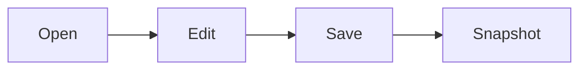
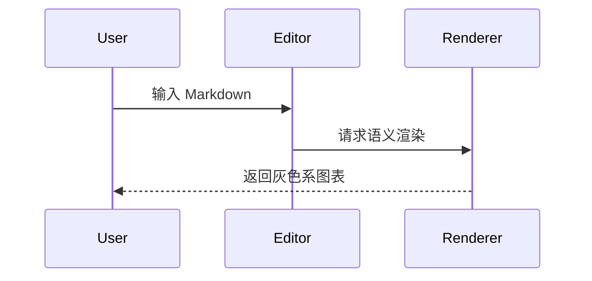

# 11

这份样例用于验证语义模式中的 **Markdown-first** 渲染能力，包含 Emoji ✅、行内代码 `const ok = true`、行内公式 $a^2 + b^2 = c^2$ 和链接 [Nomo](https://example.com)。

## 1. 标题层级

### 三级标题

#### 四级标题

##### 五级标题

###### 六级标题

## 2. Task List / Checkbox List

- [x] 已完成任务可以在语义模式直接切换
- [ ] 未完成任务可以点击勾选
- [ ] 支持 Emoji、中文和英文 Todo item ✨

## 3. 表格

| 能力 | 状态 | 说明 |
| :--- | :---: | :--- |
| 表格渲染 | ✅ | pipe table 应显示为基础表格 |
| Checkbox | ⏳ | 点击后回写 Markdown |
| Emoji | ✅ | 必须原样显示 |

## 4. 引用块

> 这是引用块。 它需要有清晰的左边框和灰色系背景。

## 5. HTML 块

<section class="demo-html-block">
  <strong>HTML 块：</strong>允许渲染内联 HTML 内容。
</section>

## 6. 数学公式

$$
E = mc^2
$$

$$
\int_0^1 x^2 dx = \frac{1}{3}
$$

## 7. Mermaid 图表



## 8. 时序图



## 9. 代码块

```ts title="src/example.ts"
type Task = {
  title: string;
  done: boolean;
};

const task: Task = { title: 'Markdown 渲染', done: true };
console.log(task);
```

```diff title="render.diff"
- const oldValue = 'plain code block';
+ const newValue = 'highlighted code block';
+ const canCopy = true;
```

```text title="long-line.txt"
这是一行很长很长的文本，用于测试自动换行开关与横向滚动行为：abcdefghijklmnopqrstuvwxyz-abcdefghijklmnopqrstuvwxyz-abcdefghijklmnopqrstuvwxyz-abcdefghijklmnopqrstuvwxyz
```

## 10. 普通列表

- 第一层项目
  - 第二层项目
- 继续输入时文档结尾必须保留空行

